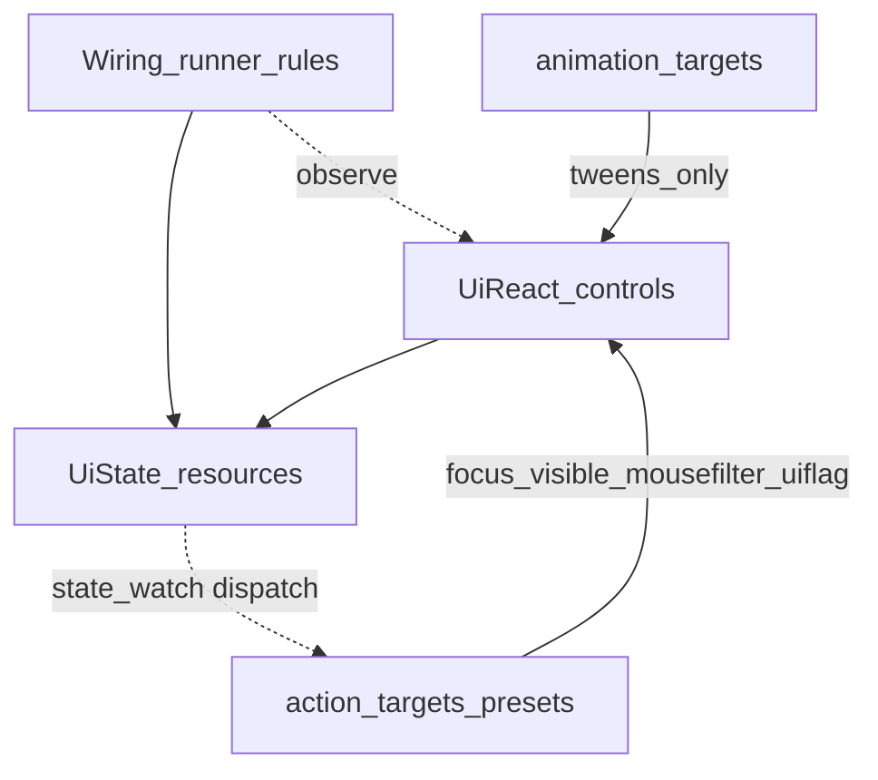

# Ui React — Action layer (normative)

**Status:** Normative specification for **Phase P6.1** (declarative **Action** layer). Runtime implementation **must** conform to this document until a superseding revision is recorded in [`CHANGELOG.md`](CHANGELOG.md) and Charter in [`ROADMAP.md`](ROADMAP.md).

**Charter (one line):** Ui React adds inspector-authored **`action_targets`** on supported **`UiReact*`** controls—one **`UiReactActionTarget`** resource per row—so **non-motion** UI reactions (focus, visibility, `mouse_filter`, narrow **`UiBoolState`** UI flags, and **bounded** **`UiFloatState`** mutations via **`UiReactStateOpService`**) are serializable and validator-friendly **without** `UiAnimTarget` / `UiAnimUtils` inside Actions. Motion stays on **`animation_targets`**.

---

## 1. Purpose and problem

**Problem:** UI **behavior** (focus moves, visibility toggles, small **UI-only** bool flags) still drifts into **coordinator scripts** even when layout and bindings are declarative.

**Action layer (normative public term):** Inspector-authored **`action_targets: Array[UiReactActionTarget]`** on **`UiReact*`** controls—the **same ergonomic pattern** as **`animation_targets: Array[UiAnimTarget]`**: **one `Resource` row**, **when** (**`UiAnimTarget.Trigger`** on control signals **or** **nullable** **`state_watch: UiBoolState`**) + **what** (closed enum + typed fields), **serializable** in `.tscn`, **validator-friendly**. The **preset library** is **`UiReactActionKind`** (v1 closed set), analogous in *shape* to **`UiAnimTarget.AnimationAction`**, **not** a dependency on the animation subsystem.

---

## 2. Hard boundary vs other layers (no overlap contract)

Normative split (mirror style of [`WIRING_LAYER.md`](WIRING_LAYER.md) §2):

| Layer | Declares | May read | May write | Must not |
|-------|----------|----------|-----------|----------|
| **Controls** | `*_state`, `animation_targets`, **`action_targets`** | user input | via bindings to state | — |
| **State** | payload | — | committed / draft / computed | — |
| **Wiring (P5)** | `wire_rules` / runner | controls + state | **`UiState`** per narrow wire rules | grab_focus, visibility orchestration, `UiAnimUtils` |
| **Actions (P6.1)** | **`action_targets`** | host control subtree | **presentation**: focus, visibility, **`Control.mouse_filter`**, **narrow** `UiBoolState` UI flags; **bounded** `UiFloatState` writes **only** via **`SUBTRACT_PRODUCT_FROM_FLOAT`** ([`UiReactStateOpService`](../../scripts/internal/react/ui_react_state_op_service.gd)) | **Any** animation or tween (`UiAnimTarget`, `UiAnimUtils`), **unbounded** / arbitrary scripts, network, replacing **transactional** Apply/Cancel, **or** duplicating **Wiring** MVP string rules |

**Wiring** answers: “**what data should this screen reflect?**”  
**Actions** answer: “**what should the UI chrome do right now (non-motion)?**”  
**Animations** answer: “**what motion should play?**” — **only** via **`animation_targets`**.

If both Wiring and Actions could touch the same `UiStringState`, **Wiring wins** for that state: Actions **must not** duplicate wiring’s three MVP wire-rule jobs (map int→string for filter keys, refresh list from catalog, copy selection detail).

**Actions vs Wiring — string and data ownership:** Actions **must not** write **`UiStringState`** for catalog lines, filter copy, selection-detail text, or any **data** those three wire-rule types own. **Only Wiring** may perform those transforms.

**Conditional user-visible copy** (labels, BBCode, “if X then string A else B”) belongs in **`UiComputed*`** or **Wiring** rules—not in **`action_targets`** as ad hoc writes to **`UiStringState`** for the same jobs **Wiring** owns on that screen; see README **Conditional strings**.

**State writes from Actions (bounded):**

- **`SET_UI_BOOL_FLAG`** — **`UiBoolState`** **UI chrome flags** only (e.g. “detail panel open”); not transactional truth, inventory counts, or domain invariants.
- **`SUBTRACT_PRODUCT_FROM_FLOAT`** — **`UiFloatState`** **only**; **control-triggered** (`state_watch` **null**); implementation **`UiReactStateOpService.subtract_product_from_accumulator`** (accumulator −= factor_a × factor_b when affordable). **No** arbitrary expressions; **no** `UiStringState` writes.

**Cross-layer:** **Computed** (`**UiComputed*`**) **derives** display state; **Actions** **mutate** allowed state on triggers; both may call the **same** op helpers internally (**DRY**). **Wiring** does **not** own shop gold math. Example **`shop_computed_demo.tscn`** uses stock **`UiComputedFloatGeProductBool`** / **`UiComputedBoolInvert`** / **`UiComputedOrderSummaryThreeFloatString`** (no demo-only computed scripts).

---

## 3. Data model (declarative, serializable)

### 3.1 Single row type: `UiReactActionTarget` (`Resource`, `class_name` in implementation)

**Structural mirror of `UiAnimTarget`:** one resource = one inspector row = one logical reaction to **either** a **control `trigger`** or a **`state_watch`** bool (mutual exclusion at runtime), with **conditional exports** driven by a **primary kind enum**.

**Public shape:** Export names and types for **`UiReactActionTarget`** and **`UiReactActionKind`** are **fixed** in this document when it ships; **SemVer** applies to changes.

Fields:

- **`enabled`**: `bool`, default `true`.
- **`state_watch`**: `@export` **nullable** **`UiBoolState`**. If **non-null**, this row is **state-driven** (§5.1). If **null**, the row is **control-signal-driven** via **`trigger`**.
- **`trigger`**: **`UiAnimTarget.Trigger`** — used **only when `state_watch` is null**. **Reuse the existing enum** (**DRY**). The enum type **lives in** `ui_anim_target.gd`; Actions **never** call animation code. **Normative intent:** shared **trigger vocabulary** only. For **control-driven** rows, **`trigger`** must be a value the **host** **`UiReact*`** actually dispatches (same per-host set as **`animation_targets`**; see **`ANIM_TRIGGERS_BY_COMPONENT`** in `editor_plugin/ui_react_component_registry.gd` — the dock warns on mismatch).
- **`action`**: **`UiReactActionKind`** — closed enum (v1 list below).
- **Path / payload fields** (shown in the Inspector only when relevant to **`action`**; see implementation `_validate_property`):
  - **`target`**: `NodePath` (`@export_node_path("Control")`) for **`GRAB_FOCUS`**, **`SET_VISIBLE`**, **`SET_MOUSE_FILTER`**.
  - **`visible_value`**: `bool` for **`SET_VISIBLE`**.
  - **`bool_flag_state`**, **`bool_flag_value`**: for **`SET_UI_BOOL_FLAG`**.
  - **`mouse_filter`**: `Control.MouseFilter` for **control-triggered** **`SET_MOUSE_FILTER`** (`state_watch` null).
  - **`mouse_filter_when_true`**, **`mouse_filter_when_false`**: for **state-driven** **`SET_MOUSE_FILTER`**.
  - **`float_accumulator`**, **`float_factor_a`**, **`float_factor_b`**: **`UiFloatState`** refs for **`SUBTRACT_PRODUCT_FROM_FLOAT`** only.

**Mutual exclusion (runtime):** If **`state_watch`** is **non-null**, **`trigger`** **does not** dispatch the row. If **`state_watch`** is **null**, dispatch uses **`trigger`** + host control signals only.

### 3.1.1 Validator rules (normative)

- **Error:** **`SET_UI_BOOL_FLAG`** field **`bool_flag_state`** is the **same resource instance** as the row’s **`state_watch`** (infinite `value_changed` loop risk).
- **Warning:** **`state_watch`** non-null **and** **`trigger`** is not **`PRESSED`** (authors should leave the default when state-driven; the editor **may** hide **`trigger`** when **`state_watch`** is set).
- **`SET_MOUSE_FILTER`:** For the two-branch path, the bool **must** come **only** from **`state_watch.get_value()`**, not from other preset fields.
- **`UiReactTransactionalActions`:** **Control-triggered** action rows (`state_watch` null) **are not supported**; only **state-driven** rows are valid on this host (validator **error**).

### 3.2 MVP enum: `UiReactActionKind`

**Adding** a value requires **CHANGELOG** entry and **SemVer minor** (additive), per Charter.

1. **`GRAB_FOCUS`** — resolve **`target`** as `Control`, `grab_focus()` if `is_inside_tree()`.
2. **`SET_VISIBLE`** — resolve **`target`** as **`CanvasItem` or `Control`**; set **`visible_value`**. Validator enforces node type.
3. **`SET_UI_BOOL_FLAG`** — write **`bool_flag_value`** to **`bool_flag_state`**. **Independent** from row **`state_watch`** (§3.1.1). **UI-only** flags; forbidden uses §2.
4. **`SET_MOUSE_FILTER`** — resolve **`target`** as **`Control`**.
   - **State-driven** (`state_watch` non-null; list-lock / **CB-015**): **`mouse_filter_when_true`** / **`mouse_filter_when_false`**, `Control.MouseFilter`; read bool from **`state_watch.get_value()`**; **initial sync** §5.1.
   - **Control-triggered** (`state_watch` null): single **`mouse_filter`** on each matching **`trigger`**.
5. **`SUBTRACT_PRODUCT_FROM_FLOAT`** — **`state_watch` must be null** (validator **error** otherwise). On **`trigger`**, call **`UiReactStateOpService.subtract_product_from_accumulator(float_accumulator, float_factor_a, float_factor_b)`**. No-op when **unaffordable** (accumulator &lt; price × qty).

**Out of scope (non-goals):** presets invoking `UiAnimTarget.apply`, `UiAnimUtils`, parallel row groups, `emit_signal` / `call` by name/string, `UiReactActionRunner`, action hub, dock graph editor, watching **non-bool** state as dispatch sources—defer **P6.2+**. (**`state_watch: UiBoolState`** **is** in v1 for the four **presentation** presets.)

### 3.3 No separate “chain” or step subclass types (v1)

- **Export:** **`action_targets: Array[UiReactActionTarget]`** (parallel to **`animation_targets`**).
- **Ordering (control-triggered):** Same **`trigger`**, **`state_watch` null** → **ascending array index** (same contract as **`UiReactAnimTargetHelper.trigger_animations`**).
- **Ordering (state-driven):** On **`state_watch.value_changed`**, run **all** rows sharing that **`state_watch`**, in **`action_targets` index order**, **synchronously**.

---

## 4. Authoring surface (per control)

- **`action_targets`** on each **`UiReact*`** in the **[`WIRING_LAYER.md`](WIRING_LAYER.md) §5** **P5.1 minimum control set**, plus **`UiReactButton`** (same **`action_targets`** / **`animation_targets`** merge pattern; **shop Buy** / **`SUBTRACT_PRODUCT_FROM_FLOAT`**); **widening** to further controls requires a **new Appendix row**.
- **No** `UiReactActionRunner`. **No** autoload.
- **`_ready` (implementation):** validate rows; connect **control** triggers (merged map with **`animation_targets`** where applicable); connect **`state_watch.value_changed`**; **`sync_initial_state`** once **`owner.is_inside_tree()`** (§5.1).

### 4.1 Helper (normative public surface)

**`UiReactActionTargetHelper`** in `scripts/internal/react/` — **must not** import animation apply/tween APIs.

- **`run_actions(owner, component_name, action_targets, trigger_type, respects_disabled?, is_disabled?)`** — control path only.
- **`sync_initial_state(owner, component_name, action_targets)`** — **once** after the control is in the tree; applies **state-driven** rows so UI matches saved **`UiBoolState`** (e.g. list-lock overlay).

Internal **`value_changed`** dispatch may be private. **Do not** merge into **`UiReactAnimTargetHelper`** (**SRP**).

---

## 5. Execution semantics

### 5.1 Two dispatch modes

- **`state_watch` null:** Row runs on host control events mapped to **`UiAnimTarget.Trigger.T`** (§5.2).
- **`state_watch` non-null:** **`trigger` ignored** for dispatch; **`value_changed`** runs the row; **`sync_initial_state`** runs **once** on load **after** `is_inside_tree()`, **before** input handling.
- A row **never** fires from **both** paths.

### 5.2 Trigger dispatch and cross-layer order (control-triggered only)

When a control emits **`UiAnimTarget.Trigger.T`**:

1. **`trigger_animations(..., T)`** **first** (unchanged).
2. **`run_actions(..., T)`** **immediately after**, **same** handler, **only** rows with **`state_watch` null** and **`trigger == T`**.

**Layer purity:** To combine **press → tween + focus**, use **two rows** on the same control: one **`animation_targets`**, one **`action_targets`**, **same** **`trigger`**, **only** when the action row is **control-triggered** (`state_watch` null). **State-driven** action rows **do not** participate in that ordering guarantee with animations unless a **documented pattern** aligns them by design.

### 5.3 Multiple rows, same trigger (control-triggered)

**Array index order**; one preset per row.

### 5.4 Sync vs async (v1)

All presets are **synchronous** (same frame).

### 5.5 Re-entrancy

If the **same** **`trigger`** or the **same** **`state_watch.value_changed`** fires **nested** while a dispatch for that source **has not returned**: **ignore** the nested call; log **one** debug-style warning. For v1 (**all sync**), this is **rare**; the rule **reserves** behavior for future async steps.

### 5.6 Failure

Invalid path, wrong type, freed node: **`push_warning`**; **skip that row**; **continue** in index order.

---

## 6. Teaching, validation, SemVer

- **Dock / CB-020:** extend validation for **`action_targets`** (null entries, paths, **`SET_UI_BOOL_FLAG`** vs **`state_watch`**, **`SET_MOUSE_FILTER`** branch fields, **`UiReactTransactionalActions`** control-triggered ban).
- **SemVer:** **`UiReactActionTarget`**, **`UiReactActionKind`**, and export shapes are **public API**; breaking ⇒ **major** (cf. **CB-039**).

---

## 7. Sequencing vs Wiring (roadmap)

**P5.1 wiring** ships before **P6.1 Action** code. **Appendix** rows **CB-042–CB-047** are the **single source of truth** for capability text ([`ROADMAP.md`](ROADMAP.md) Part II).

**Note:** An addon release may ship **P6.1 Action** implementation (resources, helper, `action_targets` on the §5 control set) **before** P5.1 wiring exit criteria are fully met. The **§2** boundary table still applies: Actions do not take over Wiring-owned **`UiStringState`** data paths. Prefer finishing **P5.1** before building **official examples** that lean heavily on Actions alongside wiring.

**Cross-links:** [`WIRING_LAYER.md`](WIRING_LAYER.md) §2 / §5; [`README.md`](../README.md) Action layer; this document.

---

## 8. Architecture diagram

---

## 9. Verification checklist

- Docs match §§1–8: coupling, **`UiStringState`**, **`state_watch`/`trigger`**, §3.1.1, **`UiReactActionKind`** list, **`SET_MOUSE_FILTER`** branches, **`SUBTRACT_PRODUCT_FROM_FLOAT`** constraints, **`sync_initial_state`**, diagram.
- Normative sections contain **no** unresolved “maybe / or” **forks**; **nullable `state_watch`** is explicit API.
- **ROADMAP** Appendix **CB-042–CB-047** only; no duplicate definitions elsewhere.

---

## 10. Non-normative notes

- **Extract `UiReactTrigger`:** Moving **`UiAnimTarget.Trigger`** to a neutral file is a **naming refactor**—track via Appendix / **CHANGELOG** when done; **not** required for P6.1 correctness.
