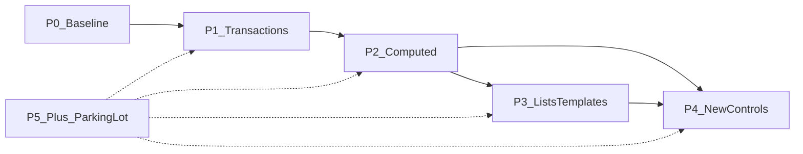

# Ui React — Roadmap

This document is the **committal** plan for **dogfooding the addon in a real game** and for **public releases**. It is reviewed **quarterly**; the **Appendix** lists every tracked capability with a phase and status so deferred work is not forgotten.

---

## Part I — Roadmap

### Glossary

| Term | Meaning |
|------|---------|
| **Computed state** | State whose value is **determined from** other state (e.g. filtered list, “can afford,” label from selection). This is the **only** public term for that idea—avoid “derived state” in API and docs to prevent synonym drift. |
| **Transaction (transactional state)** | A **draft / working copy** of settings (or similar) separate from **committed** values, with an explicit **apply**, **cancel**, or **revert** path—not the same as computed state. |

### Charter (lock-in)

| Topic | Commitment |
|-------|------------|
| **One-sentence v1.0 promise** | Reactive **UiState** bindings to common Controls, **inspector-driven animations**, and an **editor diagnostics dock**. |
| **Primary user** | Solo / small-team indie developers using Godot. |
| **Godot version** | **4.5+** only (see `project.godot` → `config/features`). |
| **Language** | **GDScript-only** addon. |
| **Compatibility** | **Semantic Versioning**: minor = additive; major = breaking changes to `class_name`, `@export` shapes, or other **documented public API**. |
| **Command pattern (v1.x)** | **Documented pattern + example** only; no mandatory `UiCommand` (or equivalent) resource in core until a **later phase** explicitly adds it. |
| **New `UiReact*` controls** | Add a wrapper only after the **same binding pattern appears 3+ times** in dogfood game code **or** is required by **two** official example scenes. |
| **Rich list / row UI** | Prefer **documentation + one example scene** before committing to heavyweight framework features (virtualization, generic grid widget). |
| **Maintenance budget** | **4–8 hours/month** for triage, documentation fixes, and Godot minor-version compatibility (adjust this line if your capacity differs). |
| **Public v1.0 vs game-complete** | Public **v1.0** ships when **core + transactional state + docs/examples** meet **P1 exit criteria** below; advanced RPG-style screens may still rely on **game-level** glue. |

### Non-goals (explicit)

- Guarantee **million-item virtualized lists** in v1.0.
- Guarantee **zero scripting** for every RPG subsystem (inventory rules, crafting, pricing logic in core).
- **C#-first** or dual-stack API.
- **Social / MMO / online** UI framework.
- Shipping **game-specific domain rules** (prices, recipes, combine tables) inside the addon core.

### Phase model

| Phase | Name | Summary |
|-------|------|---------|
| **P0** | Now / baseline | Current addon: `Ui*` states, `UiReact*` controls, `UiAnimUtils` + `UiAnimTarget`, editor dock with validator/scanner. Documentation anchor only—no additional delivery commitment. |
| **P1** | Transactional state | Minimal draft / commit / revert via **`UiTransactionalState`**; batch **Apply** / **Cancel** via **`UiTransactionalGroup`** + **`UiReactTransactionalActions`** (no command resource). **Validation:** **Options**-class example **`options_transactional_demo.tscn`**. |
| **P2** | Computed state | Minimal computed resource or helper with **explicit dependencies** and documented limits (no general graph solver promise in v1). **Validation:** at least one **shop** or **inventory-filter** example (example scene is acceptable before the full game screen exists). |
| **P3** | List richness and templates | README recipe + example for row templates / icon lists; optional incremental changes to `UiReactItemList` **only if** scoped in an issue. **Validation:** documented + runnable example. |
| **P4** | Selective new react controls | e.g. `UiReactTextureButton` / slot pattern, `UiReactTree`—**only** when the **3× rule** (Charter) fires; each new control aligns **scanner** (`UiReactScannerService`) and **validator** (`BINDINGS_BY_COMPONENT`) when new bindings are introduced. |
| **P5+** | Parking lot | Virtualization, state debug overlay, major dock modularization, first-class command resource, deep undo stacks—**not sequenced** until promoted from the Appendix. |

### Screen coverage matrix (honest)

Not every row is a v1.0 promise; this maps **Megaman-style** UI goals to **phases** where work lands.

| Screen / use case | P0 (today) | P1 | P2 | P3 | P4 |
|-------------------|------------|----|----|----|-----|
| Main menu | yes | — | nicer transitions (docs) | — | maybe |
| Options + apply/cancel | partial | **yes** (example scene) | — | — | — |
| Inventory | partial | — | filters | rows/templates | slots / tree |
| Shop | partial | — | totals / afford | rows | — |
| Equipment / combine | weak | — | preview stats | templates | slots / rules UI |

### Exit criteria (committal)

**P1 — Transactional state**

**Orchestration note (non-command, non-computed):** Screens with multiple transactional states use **`UiTransactionalGroup`** (`begin_edit_all` / `apply_all` / `cancel_all`) and optional inspector wiring **`UiReactTransactionalActions`** on **`BaseButton`** paths—no autoload scanner, no per-control connection arrays, and no mandatory `UiCommand`-style resource (Charter).

- [x] Implementation merged: **`UiTransactionalState`**, **`UiTransactionalGroup`**, **`UiReactTransactionalActions`** (see addon `scripts/api/models/` and `scripts/controls/`).
- [x] README section describes draft / apply / cancel and links to example.
- [x] Example scene or shipped game screen path documented (path in the Appendix **Notes** when known).
- [x] `CHANGELOG.md` entry (minor or patch per SemVer).
- [x] Editor dock validator updated **if** new resource types participate in binding diagnostics.

**P2 — Computed state**

- [x] Implementation merged with documented dependency limits (no “solver” claim).
- [x] README + glossary cross-link.
- [x] Example: shop or inventory-filter scenario (**`shop_computed_demo.tscn`**, **`inventory_list_demo.tscn`** — see Appendix **Notes**).
- [x] `CHANGELOG.md` entry.
- [x] Dock/scanner updates **if** new state classes are first-class in diagnostics.

**P3 — List richness and templates**

- [x] README recipe + runnable example scene.
- [x] Optional `UiReactItemList` changes merged only via scoped issue (none in **2.2.1**; additive list work remains issue-scoped).
- [x] `CHANGELOG.md` entry when code or notable docs ship.

### Review process

- **Quarterly:** Re-read Charter and Non-goals; still accurate? Promote or demote Appendix rows; close or open phases.
- **Releases:** Version bumps follow **CHANGELOG.md**; this file does not duplicate SemVer rules beyond the Charter.

---

## Part II — Appendix: capability backlog

Single source of truth for **every** discussed capability. **Target phase** references Part I. **Status**: `Planned` | `InProgress` | `Done` | `Deferred` | `Wont`. Update **Notes** with version or doc anchor when `Done`.

| ID | Capability / topic | Screen examples | Target phase | Status | Notes |
|----|-------------------|-----------------|--------------|--------|-------|
| CB-001 | Core: `UiState`, `UiReact*`, `UiAnimUtils`, `UiAnimTarget`, editor dock | All | P0 | Done | Baseline shipped; maintain compat per SemVer. Includes typed diagnostics (`IssueKind`/`resource_path`), scene-file-scoped unused `UiState` `.tres` diagnostics (no cross-scene clutter), Reveal + persisted ignore flows, and filesystem-triggered dock refresh. |
| CB-002 | Transactional / draft state (apply, cancel, revert) | Options, key remap drafts | P1 | Done | **`UiTransactionalState`** + **`UiTransactionalGroup`** + **`UiReactTransactionalActions`**; README + **`options_transactional_demo.tscn`**. Status line uses **`UiComputedStringState`** + **`UiReactComputedSync`** (**2.2.0**). |
| CB-003 | Computed state (explicit dependencies, documented limits) | Shop totals, afford flags, filtered inventory | P2 | Done | **`UiComputedStringState`**, **`UiComputedBoolState`**, **`UiReactComputedSync`**; README; **`shop_computed_demo.tscn`**; **`options_transactional_demo.tscn`**. **2.2.0**. Text-filter list demo (**`inventory_list_demo.tscn`**, **2.2.1**) complements inventory filtering without new computed-array core. |
| CB-004 | Explicit dependency / recalc rules (documented) | Same as CB-003 | P2 | Done | Same release as CB-003; cap **32** **`sources`**, no solver (README **Computed state**). |
| CB-005 | Undo stack / nested transactions | Advanced options | P5+ | Deferred | Not v1.0 scope; promote if needed. |
| CB-006 | Command pattern **as docs + example** (not mandatory core API) | Shop buy/sell, equip confirm | P1–P2 | Planned | Sidecar to P1/P2 docs; see Charter command scope. |
| CB-007 | First-class command resource (e.g. `UiCommand`) | Same | P5+ | Deferred | Only after doc pattern proves shape. |
| CB-008 | Richer `ItemList` / icons | Inventory, shop list | P3 | Planned | Optional code; issue-scoped. Not part of **2.2.1**. |
| CB-009 | Row template / static body pattern (docs + example) | Inventory, shop, loot | P3 | Done | README **List patterns (P3)** + **`inventory_list_demo.tscn`** / **`inventory_list_demo.gd`**. **2.2.1**. |
| CB-010 | Virtualization / paging | Huge inventories | P5+ | Deferred | Measure need first. |
| CB-011 | Filtering and sorting recipes (documentation) | Inventory | P2 | Done | Filter recipe in README **List patterns (P3)**; sort left as game-layer exercise. **2.2.1**. |
| CB-012 | `UiReactTextureButton` or slot helper | Equipment grid, hotbar | P4 | Planned | 3× rule or two example scenes. |
| CB-013 | `UiReactTree` | Categorized shop, hierarchical lists | P4 | Planned | Same inclusion rule as CB-012. |
| CB-014 | `UiReactTextEdit` / `UiReactRichTextLabel` | Journal, long text | P4 | Deferred | Low priority unless repeated binding need. |
| CB-015 | `ItemList` `disabled_state` no-op — documented workaround | Any list that needs gating | P3 | Done | README **List patterns (P3)** + **`inventory_list_demo.tscn`** overlay + **`UiBoolState`**. **2.2.1**. |
| CB-016 | Screen transition presets (documentation / thin helper) | Main menu, pause | P2–P3 | Planned | Align with existing `UiAnimUtils` presets where possible. |
| CB-017 | Modal / focus-trap recipe | Confirm dialogs, popups | P3 | Planned | Docs + Godot focus API links. |
| CB-018 | State graph / debug overlay (editor or runtime) | Development | P5+ | Deferred | Productivity tool; after core phases. |
| CB-019 | Dock modularization (internal refactor) | N/A | P5+ | Deferred | Maintainability; no user-facing v1.0 promise. |
| CB-020 | Scanner + validator updates for new bindings | All new controls/states | Ongoing | Planned | Mirror `UiReactScannerService` / `BINDINGS_BY_COMPONENT` per control. |
| CB-021 | Semver + CHANGELOG discipline | Releases | Ongoing | InProgress | Keep `CHANGELOG.md` aligned with releases. |
| CB-022 | Example: options draft / apply | Options | P1 | Done | **`res://addons/ui_react/examples/options_transactional_demo.tscn`**. |
| CB-023 | Example: shop math / afford | Shop | P2 | Done | **`res://addons/ui_react/examples/shop_computed_demo.tscn`** (**2.2.0**). |
| CB-024 | Example: inventory filter | Inventory | P2 | Done | **`res://addons/ui_react/examples/inventory_list_demo.tscn`** (**2.2.1**). |
| CB-025 | Escape hatch documentation (plain `Control` + `UiState`) | Complex one-off UI | P3 | Planned | Reduce support burden for edge layouts. |
| CB-026 | Full RPG “no scripting” guarantee | — | Wont | Wont | Conflicts with Non-goals. |
| CB-027 | MMO / social UI framework | — | Wont | Wont | Out of scope. |
| CB-028 | C#-first API | — | Wont | Wont | GDScript-only Charter. |
| CB-029 | Enterprise support SLA | — | Wont | Wont | Indie/small-team focus. |
| CB-030 | Game-specific domain rules in core (prices, recipes) | — | Wont | Wont | Belongs in game layer. |

---

*Last updated: 2026-04-01 — **2.2.1** ships P3 list patterns + **`inventory_list_demo`**; **2.2.0** shipped computed state + shop/options; update quarterly or when phases close.*
