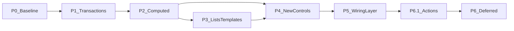

# Ui React — Roadmap

This document is the **committal** plan for **dogfooding the addon in a real game** and for **public releases**. It is reviewed **quarterly**; the **Appendix** lists every tracked capability with a phase and status so deferred work is not forgotten.

---

## Part I — Roadmap

### Glossary

| Term | Meaning |
|------|---------|
| **Computed state** | State whose value is **determined from** other state (e.g. filtered list, “can afford,” label from selection). This is the **only** public term for that idea—avoid “derived state” in API and docs to prevent synonym drift. |
| **Transaction (transactional state)** | A **draft / working copy** of settings (or similar) separate from **committed** values, with an explicit **apply**, **cancel**, or **revert** path—not the same as computed state. |
| **Wiring** | Inspector-authored **`UiReactWireRule`** resources + **`UiReactWireRunner`** (and optionally **`UiReactWireHub`** after **P5.1**), replacing ad-hoc root orchestration for supported patterns. Normative detail: [`WIRING_LAYER.md`](WIRING_LAYER.md). |
| **Action layer** | Inspector-authored **`action_targets`** + **`UiReactActionTarget`** on the P5.1 wiring control set only—**non-motion** UI reactions (focus, visibility, `mouse_filter`, narrow UI **`UiBoolState`** flags). **No** `UiAnimTarget` / `UiAnimUtils` inside Actions. Normative detail: [`ACTION_LAYER.md`](ACTION_LAYER.md). |

### Charter (lock-in)

| Topic | Commitment |
|-------|------------|
| **One-sentence v1.0 promise** | Reactive **UiState** bindings to common Controls, **inspector-driven animations**, and an **editor diagnostics dock**. |
| **Primary user** | Solo / small-team indie developers using Godot. |
| **Godot version** | **4.5+** only (see `project.godot` → `config/features`). |
| **Language** | **GDScript-only** addon. |
| **Compatibility** | **Semantic Versioning**: minor = additive; major = breaking changes to `class_name`, `@export` shapes, or other **documented public API**. |
| **Command pattern (v1.x)** | **Documented pattern + example** only; no mandatory `UiCommand` (or equivalent) resource in core until a **later phase** explicitly adds it. |
| **New `UiReact*` controls** | Add a wrapper only after the **same binding pattern appears 3+ times** in dogfood game code **or** is required by **two** official example scenes. |
| **Rich list / row UI** | Prefer **documentation + one example scene** before committing to heavyweight framework features (virtualization, generic grid widget). |
| **Maintenance budget** | **4–8 hours/month** for triage, documentation fixes, and Godot minor-version compatibility (adjust this line if your capacity differs). |
| **Public v1.0 vs game-complete** | **v1.0** remains **P1 exit** as before. **P5 wiring** is the **committed path** to eliminate **addon-documented** root glue from **official examples**; games may still use game-layer scripts for domain logic per Non-goals. |
| **Wiring layer** | **P5** delivers runner + rule resources + per-control `wire_rules`; **P5.1.b** optionally adds **`UiReactWireHub`** (central `rules` array); **P5.2** delivers dock UI only (**CB-035**). |

### Non-goals (explicit)

- Guarantee **million-item virtualized lists** in v1.0.
- Guarantee **zero scripting** for every RPG subsystem (inventory rules, crafting, pricing logic in core).
- **C#-first** or dual-stack API.
- **Social / MMO / online** UI framework.
- Shipping **game-specific domain rules** (prices, recipes, combine tables) inside the addon core.
- **Wiring layer** does **not** embed **game catalogs**, **loot tables**, or **pricing**—it **references** game-authored `Resource`s or state only.

### Phase model

| Phase | Name | Summary |
|-------|------|---------|
| **P0** | Now / baseline | Current addon: `Ui*` states, `UiReact*` controls, `UiAnimUtils` + `UiAnimTarget`, editor dock with validator/scanner. Documentation anchor only—no additional delivery commitment. |
| **P1** | Transactional state | Minimal draft / commit / revert via **`UiTransactionalState`**; batch **Apply** / **Cancel** via **`UiTransactionalGroup`** + **`UiReactTransactionalActions`** (no command resource). **Validation:** **Options**-class example **`options_transactional_demo.tscn`**. **Delivery complete** (historical). |
| **P2** | Computed state | Minimal computed resource or helper with **explicit dependencies** and documented limits (no general graph solver promise in v1). **Validation:** at least one **shop** or **inventory-filter** example. **Delivery complete** (historical). |
| **P3** | List richness and templates | README recipe + example for row templates / icon lists; optional incremental changes to `UiReactItemList` **only if** scoped in an issue. **Delivery complete** (historical). |
| **P4** | Selective new react controls | e.g. `UiReactTextureButton` / slot pattern, `UiReactTree`—**only** when the **3× rule** (Charter) fires; each new control aligns **scanner** (`UiReactScannerService`) and **validator** (`BINDINGS_BY_COMPONENT`) when new bindings are introduced. **Delivery complete** (historical). |
| **P5** | Wiring layer | **`UiReactWireRunner`**, **`UiReactWireRule`** family, **`wire_rules`** on P5.1 control set, diagnostics, example migration per [`WIRING_LAYER.md`](WIRING_LAYER.md). Sub-milestones: **P5.1** (core), **P5.1.b** (optional **`UiReactWireHub`**), **P5.2** (dock wire editor, **CB-035**). |
| **P6.1** | Declarative Actions | **`action_targets`**, **`UiReactActionTarget`**, **`UiReactActionTargetHelper`** on **[`WIRING_LAYER.md`](WIRING_LAYER.md) §5** control set; validator/scanner; runnable example merged into **`inventory_screen_demo.tscn`**. **Normative** [`ACTION_LAYER.md`](ACTION_LAYER.md). Ships **after** P5.1 wiring core. |
| **P6+** | Deferred parking | Virtualization, state debug overlay, major dock modularization, first-class command resource, deep undo stacks—**not sequenced** until promoted from the Appendix; see **CB-005**, **CB-007**, **CB-010**, **CB-018**, **CB-019**, and other rows with Target phase **P6+**. |

### Screen coverage matrix (honest)

Not every row is a v1.0 promise; this maps **Megaman-style** UI goals to **phases** where work lands.

| Screen / use case | P0 (today) | P1 | P2 | P3 | P4 | P5 |
|-------------------|------------|----|----|----|----|-----|
| Main menu | yes | — | nicer transitions (docs) | — | maybe | — |
| Options + apply/cancel | partial | **yes** (example scene) | — | — | — | — |
| Inventory | partial | — | filters | rows/templates | slots / tree | **reduced root glue** via wiring |
| Shop | partial | — | totals / afford | rows | — | wiring for supported filter/selection patterns |
| Equipment / combine | weak | — | preview stats | templates | slots / rules UI | — |

### Exit criteria (committal)

#### Completed phases (historical)

**P1 — Transactional state**

**Orchestration note (non-command, non-computed):** Screens with multiple transactional states use **`UiTransactionalGroup`** (`begin_edit_all` / `apply_all` / `cancel_all`) and optional inspector wiring **`UiReactTransactionalActions`** on **`BaseButton`** paths—no autoload scanner, no per-control connection arrays, and no mandatory `UiCommand`-style resource (Charter).

- [x] Implementation merged: **`UiTransactionalState`**, **`UiTransactionalGroup`**, **`UiReactTransactionalActions`** (see addon `scripts/api/models/` and `scripts/controls/`).
- [x] README section describes draft / apply / cancel and links to example.
- [x] Example scene or shipped game screen path documented (path in the Appendix **Notes** when known).
- [x] `CHANGELOG.md` entry (minor or patch per SemVer).
- [x] Editor dock validator updated **if** new resource types participate in binding diagnostics.

**P2 — Computed state**

- [x] Implementation merged with documented dependency limits (no “solver” claim).
- [x] README + glossary cross-link.
- [x] Example: shop or inventory-filter scenario (**`shop_computed_demo.tscn`**, **`inventory_screen_demo.tscn`**).
- [x] `CHANGELOG.md` entry.
- [x] Dock/scanner updates **if** new state classes are first-class in diagnostics.

**P3 — List richness and templates**

- [x] README recipe + runnable example scene.
- [x] Optional `UiReactItemList` changes merged only via scoped issue (none in **2.2.1**; additive list work remains issue-scoped).
- [x] `CHANGELOG.md` entry when code or notable docs ship.

#### P5 — Wiring layer (active)

**P5.1 — Wiring core**

- [x] **`UiReactWireRunner`** implemented; **one runner per scene** rule enforced; duplicate-runner **warning** in dock when multiple runners detected (**CB-034**).
- [x] **`UiReactWireRule`** abstract base + **three** concrete rules named in [`WIRING_LAYER.md`](WIRING_LAYER.md) (MVP rule types §6) shipped.
- [x] **`wire_rules`** export on **P5.1 control set** defined in [`WIRING_LAYER.md`](WIRING_LAYER.md) (§5).
- [x] **`inventory_screen_demo`** migrated per **exception (documented here):** root script retains **tree construction** (engine `TreeItem` population), **demo-only** pressed-state debug labels, and **optional** `detail_note_state` suffix for **Use/Sort** notes (`inventory_screen_demo.gd`). **All filter / list / detail data wiring** is **`wire_rules` + `UiReactWireRunner`** (stock-take: [`P5_CURRENT_STATE_AUDIT.md`](P5_CURRENT_STATE_AUDIT.md) §B).
- [x] README **List patterns** / inventory pointers reference **wiring** for filter+selection patterns.
- [x] **`CHANGELOG.md`** documents P5.1 + **CB-034** completion in **`[2.7.0]`** (see SemVer policy).
- [x] **Dock validator** for wired scenes: missing **`UiReactWireRunner`** + duplicate runners; per-rule **wire_rules** export validation (MVP types); **`UiReactTransactionalActions`** in **`UiReactScannerService`**; **wire_rules** **`UiState`** refs in unused-file collector (**CB-034** complete for P5.1 scope; hub checks remain **CB-041**). See [`P5_CURRENT_STATE_AUDIT.md`](P5_CURRENT_STATE_AUDIT.md) §C.

**P5.1.b — Optional wire hub** (after P5.1 exit)

- [ ] **`UiReactWireHub`** node with `rules: Array[UiReactWireRule]`; runner collects rules from **both** per-control **`wire_rules`** and hub(s); **deduplication** when the same rule subresource is referenced twice (**CB-041**).
- [ ] Validator (**CB-041**) flags invalid hub/runner placement (hub outside runner subtree, hub with no runner, etc.).

**P5.2 — Dock wire editor**

- [ ] Dock UI creates/edits **only** existing `UiReactWireRule` subresources; **no** parallel format (**CB-035**).
- [ ] **CHANGELOG** + README pointer.

#### P6.1 — Declarative Action layer

- [x] Normative **[`ACTION_LAYER.md`](ACTION_LAYER.md)** + cross-links (**CB-042**).
- [x] **`UiReactActionTarget`** + **`UiReactActionKind`**, P5.1 control **`action_targets`** exports (**CB-043** / **CB-045**).
- [x] **`UiReactActionTargetHelper`** (`run_actions`, `sync_initial_state`, state-watch wiring) (**CB-044**).
- [x] Dock validator: **`action_targets`** rows (**CB-046**, extends **CB-020**).
- [x] Example **`inventory_screen_demo.tscn`**: **`action_targets`** list lock (**`SET_MOUSE_FILTER`**) + **`GRAB_FOCUS`** on unlock (**CB-047**); standalone **`action_layer_demo.tscn`** removed in favor of merged screen.
- [x] **CHANGELOG** + **README** + **plugin.cfg** version bump for additive surface.

### Review process

- **Quarterly:** Re-read Charter and Non-goals; still accurate? Promote or demote Appendix rows; close or open phases.
- **Quarterly:** Reconcile **`CB-031`–`CB-047`**, [`WIRING_LAYER.md`](WIRING_LAYER.md), and [`ACTION_LAYER.md`](ACTION_LAYER.md) with implementation drift; re-run stock-take [`P5_CURRENT_STATE_AUDIT.md`](P5_CURRENT_STATE_AUDIT.md) when wiring diagnostics or rules change materially.
- **Releases:** Version bumps follow **CHANGELOG.md**; this file does not duplicate SemVer rules beyond the Charter.

---

## Part II — Appendix: capability backlog

Single source of truth for **every** discussed capability. **Target phase** references Part I. **Status**: `Planned` | `InProgress` | `Done` | `Deferred` | `Wont`. Update **Notes** with version or doc anchor when `Done`.

| ID | Capability / topic | Screen examples | Target phase | Status | Notes |
|----|-------------------|-----------------|--------------|--------|-------|
| CB-001 | Core: `UiState`, `UiReact*`, `UiAnimUtils`, `UiAnimTarget`, editor dock | All | P0 | Done | Baseline shipped; maintain compat per SemVer. Includes typed diagnostics (`IssueKind`/`resource_path`), scene-file-scoped unused `UiState` `.tres` diagnostics (no cross-scene clutter), Reveal + persisted ignore flows, and filesystem-triggered dock refresh. |
| CB-002 | Transactional / draft state (apply, cancel, revert) | Options, key remap drafts | P1 | Done | **`UiTransactionalState`** + **`UiTransactionalGroup`** + **`UiReactTransactionalActions`**; README + **`options_transactional_demo.tscn`**. Status line uses **`UiComputedStringState`** + **`UiReactComputedSync`** (**2.2.0**). |
| CB-003 | Computed state (explicit dependencies, documented limits) | Shop totals, afford flags, filtered inventory | P2 | Done | **`UiComputedStringState`**, **`UiComputedBoolState`**, **`UiReactComputedSync`**; README; **`shop_computed_demo.tscn`**; **`options_transactional_demo.tscn`**. **2.2.0**. Inventory filtering lives on **`inventory_screen_demo.tscn`** (successor to removed **`inventory_list_demo`**). |
| CB-004 | Explicit dependency / recalc rules (documented) | Same as CB-003 | P2 | Done | Same release as CB-003; cap **32** **`sources`**, no solver (README **Computed state**). |
| CB-005 | Undo stack / nested transactions | Advanced options | P6+ | Deferred | Not v1.0 scope; promote if needed. |
| CB-006 | Command pattern **as docs + example** (not mandatory core API) | Shop buy/sell, equip confirm | P1–P2 | Done | README **Imperative actions**; **`shop_computed_demo.gd`** + **`shop_computed_demo.tscn`**. **2.3.0**. No **`UiCommand`** in core. |
| CB-007 | First-class command resource (e.g. `UiCommand`) | Same | P6+ | Deferred | Only after doc pattern proves shape. |
| CB-008 | Richer `ItemList` / icons | Inventory, shop list | P3 | Done | **`UiReactItemList`** dictionary rows **`label`/`text`** + optional **`icon`**; **`inventory_screen_demo.tscn`** uses **`res://icon.svg`** on a sample row. **2.3.0**. |
| CB-009 | Row template / static body pattern (docs + example) | Inventory, shop, loot | P3 | Done | README **List patterns (P3)** + **`inventory_screen_demo.tscn`** / **`inventory_screen_demo.gd`**. **2.2.1**. |
| CB-010 | Virtualization / paging | Huge inventories | P6+ | Deferred | Measure need first. |
| CB-011 | Filtering and sorting recipes (documentation) | Inventory | P2 | Done | Filter recipe in README **List patterns (P3)**; sort left as game-layer exercise. **2.2.1**. |
| CB-012 | `UiReactTextureButton` or slot helper | Equipment grid, hotbar | P4 | Done | **`UiReactTextureButton`** (`scripts/controls/ui_react_texture_button.gd`); README; **`inventory_screen_demo.tscn`**. **`texture_button_demo`** removed in example consolidation. **2.4.0**. |
| CB-013 | `UiReactTree` | Categorized shop, hierarchical lists | P4 | Done | **`UiReactTree`** (`scripts/controls/ui_react_tree.gd`); README **UiReactTree binding semantics**; **`inventory_screen_demo.tscn`**. **`tree_demo`** removed in consolidation. **2.4.0**. |
| CB-014 | **`UiReactRichTextLabel`** (BBCode display binding); **`UiReactTextEdit`** deferred | Journal, long text | P4 | Done | **`UiReactRichTextLabel`** + **`shop_computed_demo.tscn`** + scanner/validator (**CB-020**) in **2.5.0**. **`rich_text_label_demo`** removed in consolidation. Multi-line **editable** **`UiReactTextEdit`** not in this release. |
| CB-015 | `ItemList` `disabled_state` no-op — documented workaround | Any list that needs gating | P3 | Done | README **List patterns (P3)** + **`inventory_screen_demo.tscn`** overlay + **`action_targets`** **`SET_MOUSE_FILTER`**. **2.2.1**. |
| CB-016 | Screen transition presets (documentation / thin helper) | Main menu, pause | P2–P3 | Done | README **Screen transitions**; **`UiAnimUtils.Preset`**. **2.3.0**. |
| CB-017 | Modal / focus-trap recipe | Confirm dialogs, popups | P3 | Done | README **Modals, popups, and focus** + Godot doc links. **2.3.0**. |
| CB-018 | State graph / debug overlay (editor or runtime) | Development | P6+ | Deferred | Productivity tool; after core phases. |
| CB-019 | Dock modularization (internal refactor) | N/A | P6+ | Deferred | Maintainability; no user-facing v1.0 promise. |
| CB-020 | Scanner + validator updates for new bindings | All new controls/states | Ongoing | Planned | Mirror `UiReactScannerService` / `BINDINGS_BY_COMPONENT` per control; **`action_targets`** validation (**CB-046**). |
| CB-021 | Semver + CHANGELOG discipline | Releases | Ongoing | InProgress | Keep `CHANGELOG.md` aligned with releases. |
| CB-022 | Example: options draft / apply | Options | P1 | Done | **`res://addons/ui_react/examples/options_transactional_demo.tscn`**. |
| CB-023 | Example: shop math / afford | Shop | P2 | Done | **`res://addons/ui_react/examples/shop_computed_demo.tscn`**; **Buy** mutation **2.3.0** (**`shop_computed_demo.gd`**). |
| CB-024 | Example: inventory filter | Inventory | P2 | Done | **`res://addons/ui_react/examples/inventory_screen_demo.tscn`** (successor to **`inventory_list_demo`**, **2.2.1** + consolidation). |
| CB-025 | Escape hatch documentation (plain `Control` + `UiState`) | Complex one-off UI | P3 | Done | README **When not to use a `UiReact*` wrapper**. **2.3.0**. |
| CB-026 | Full RPG “no scripting” guarantee | — | Wont | Wont | Conflicts with Non-goals. |
| CB-027 | MMO / social UI framework | — | Wont | Wont | Out of scope. |
| CB-028 | C#-first API | — | Wont | Wont | GDScript-only Charter. |
| CB-029 | Enterprise support SLA | — | Wont | Wont | Indie/small-team focus. |
| CB-030 | Game-specific domain rules in core (prices, recipes) | — | Wont | Wont | Belongs in game layer. |
| CB-031 | Normative [`WIRING_LAYER.md`](WIRING_LAYER.md) + roadmap P5 | All | P5 | Done | Normative spec maintained; stock-take [`P5_CURRENT_STATE_AUDIT.md`](P5_CURRENT_STATE_AUDIT.md). |
| CB-032 | **`UiReactWireRunner`** (scene node, non-autoload) | Any wired scene | P5 | Done | `scripts/controls/ui_react_wire_runner.gd`; see audit §A. |
| CB-033 | **`UiReactWireRule`** abstract base + concrete MVP rules (three named in [`WIRING_LAYER.md`](WIRING_LAYER.md)) | Inventory, filters | P5 | Done | `scripts/api/models/ui_react_wire_*.gd`; see audit §A. |
| CB-034 | **`wire_rules`** export on P5.1 control set + dock/validator + editor parity | Same | P5 | Done | **Shipped:** missing/duplicate runner; MVP **rule export** validation; unused-**`UiState`** scan includes **`wire_rules`** refs; **`UiReactTransactionalActions`** scanner registration (**2.7.0**). **Hub / placement:** **CB-041**. See [`WIRING_LAYER.md`](WIRING_LAYER.md) §9. |
| CB-035 | Dock **graph or form** editor for wire rules (edits same resources) | N/A | P5.2 | Planned | **After** P5.1; **no** alternate format. |
| CB-036 | Migrate **`inventory_list_demo`** off orchestration glue | Inventory | Wont | Wont | Scene removed; **`inventory_screen_demo.tscn`** is the canonical inventory example (**CB-037**). |
| CB-037 | Migrate **`inventory_screen_demo`** off orchestration glue | Inventory | P5 | Done | Filter/list/detail via **`wire_rules`** + **`UiReactWireRunner`**; root script keeps tree build + demo-only notes/labels (ROADMAP P5.1 exception). Stock-take: [`P5_CURRENT_STATE_AUDIT.md`](P5_CURRENT_STATE_AUDIT.md) §B. |
| CB-038 | Migrate remaining examples with root glue (**`shop_computed_demo.gd`**, etc.) only where wiring **replaces** glue without losing teaching value | Demos | P5 | Planned | Standalone **`tree_demo`** / **`texture_button_demo`** removed; coverage lives on **`inventory_screen_demo`**. |
| CB-039 | **Semantic versioning** policy: wiring API (`UiReactWireRunner`, `UiReactWireRule` subclasses, `wire_rules` shape) is **public**; breaking changes **major** | Releases | P5 | Planned | CHANGELOG + Charter cross-link. |
| CB-040 | Remove or archive legacy **P5**-plus phase wording repo-wide; **P6+** is only deferred bucket | Docs | P5 | Planned | Grep pass in `addons/ui_react` for the legacy token (no `5` + `+` contiguous in docs). |
| CB-041 | **`UiReactWireHub`** optional node; central **`rules`** array; runner aggregates hub + per-control **`wire_rules`** with **dedup**; validator expectations for bad hub/runner setups | Dense inventory/shop screens | P5.1.b | Planned | Normative in [`WIRING_LAYER.md`](WIRING_LAYER.md) §7; **after** P5.1 exit; extends **CB-034**. |
| CB-042 | Normative **[`ACTION_LAYER.md`](ACTION_LAYER.md)** (Action layer contract) | All inspector-driven UI | P6.1 | Done | Shipped **2.6.4**; cross-links ROADMAP / WIRING / README. |
| CB-043 | **`UiReactActionTarget`** resource + **`UiReactActionKind`** (four MVP presets) | Focus, visibility, mouse filter, UI flags | P6.1 | Done | `scripts/api/models/ui_react_action_target.gd`; **2.6.4**. |
| CB-044 | **`UiReactActionTargetHelper`** (`run_actions`, `sync_initial_state`, `state_watch` wiring) | Same | P6.1 | Done | `scripts/internal/react/ui_react_action_target_helper.gd`; **2.6.4**. |
| CB-045 | **`action_targets`** export on **[`WIRING_LAYER.md`](WIRING_LAYER.md) §5** control set | P5.1 controls + transactional actions host | P6.1 | Done | **2.6.4**: ItemList, Tree, LineEdit, CheckBox, `UiReactTransactionalActions` (state-driven rows only on transactional host). |
| CB-046 | Dock validator for **`action_targets`** (paths, loops, transactional constraint) | Editor | P6.1 | Done | **`UiReactValidatorService`**; extends **CB-020**; **2.6.4**. |
| CB-047 | Action layer runnable example | Demos | P6.1 | Done | **`inventory_screen_demo.tscn`**: **`SET_MOUSE_FILTER`** list lock + **`GRAB_FOCUS`** on unlock; **2.6.4** (standalone **`action_layer_demo`** removed in consolidation). |

---

*Last updated: 2026-04-04 — **CB-034** (P5.1 dock scope) **Done** (**2.7.0**); **CB-041** hub validator still **Planned**. Stock-take: [`P5_CURRENT_STATE_AUDIT.md`](P5_CURRENT_STATE_AUDIT.md). Examples remain **four** scenes.*
