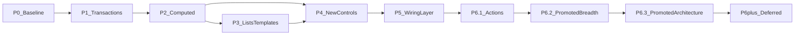

# Ui React — Roadmap

This document is the **committal** plan for **public releases** and **maintained official examples** (`addons/ui_react/examples/`). Proof of new UI surface is **example-driven** (README-indexed scenes), not private-game dogfood—see **Charter**. It is reviewed **quarterly**; the **Appendix** lists every tracked capability with a phase and status so deferred work is not forgotten.

---

## Part I — Roadmap

### Glossary

| Term | Meaning |
|------|---------|
| **Computed state** | State whose value is **determined from** other state (e.g. filtered list, “can afford,” label from selection). This is the **only** public term for that idea—avoid “derived state” in API and docs to prevent synonym drift. |
| **Transaction (transactional state)** | A **draft / working copy** of settings (or similar) separate from **committed** values, with an explicit **apply**, **cancel**, or **revert** path—not the same as computed state. |
| **Wiring** | Inspector-authored **`UiReactWireRule`** resources + **`UiReactWireRuleHelper`** on each **`UiReact*`** host (**`wire_rules`**), replacing ad-hoc root orchestration for supported patterns. Normative detail: [`WIRING_LAYER.md`](WIRING_LAYER.md). |
| **Action layer** | Inspector-authored **`action_targets`** + **`UiReactActionTarget`** on the **[`WIRING_LAYER.md`](WIRING_LAYER.md) §5** control set (includes **`UiReactOptionButton`**, **`UiReactTabContainer`**) **and** **`UiReactButton`** / **`UiReactTextureButton`** ([`ACTION_LAYER.md`](ACTION_LAYER.md) §4)—**non-motion** UI reactions (focus, visibility, `mouse_filter`, narrow UI **`UiBoolState`** flags) **plus** **bounded** **`UiFloatState`** mutations (**`SUBTRACT_PRODUCT_FROM_FLOAT`**, …). **No** `UiAnimTarget` / `UiAnimUtils` inside Actions. Widening **`action_targets`** to controls **not** listed in §5 / §4 requires a new **Appendix** row. Normative detail: [`ACTION_LAYER.md`](ACTION_LAYER.md). |
| **Official example** | A **committed** scene under **`res://addons/ui_react/examples/`**, **Play**-runnable, listed in addon [**README**](../README.md) **Quickstart** (or otherwise referenced from this roadmap) so scope stays **objective** for PRs. |
| **Evidence bar (Charter)** | **Symmetry + example-driven delivery:** no new or widened **`UiReact*`** inspector **proof** without meeting the **Charter** table—**Appendix** / **Inspector surface matrix** tracking **plus** official example usage as specified there. |

### Stock computed library (future)

Additional **stock** **`UiComputedStringState` / `UiComputedBoolState`** subclasses for repeated **conditional copy** patterns (beyond today’s shop/options stock types) are **backlog**, not API promises—see **Appendix CB-048** and README **Conditional strings**. Ship only when a second screen needs the same shape (**YAGNI**).

### Tracked follow-ups (product parity — 2026)

**Done:** **CB-049**, **CB-050** (**2.17.0**); **CB-052**, **CB-054**, **CB-055** (**2.18.0** surface); **CB-056** (**2.19.0** / **2.19.1**); **CB-057** (**2.20.0**); **CB-051** (**2.21.0**); **CB-035** (**2.22.0** — dock **`wire_rules`** editor). **Promoted from deferred to planned (2026-04-17):** **CB-053** (plugin/designer UX tranches), **CB-007** (first-class commands), **CB-018** runtime overlay slice, **CB-059** (rich grid/slot framework), **CB-060** (declarative breadth for Slider/SpinBox/ProgressBar). **North star (designer tooling):** **CB-058** — **Wiring** workbench (**Dependency Graph** + list) as the **blessed editor** surface for wiring (see below).

### Promotion policy (2026-04-17)

The promoted rows above are a **committed direction**, not a release-date promise. Until shipped, API shape remains provisional and must keep Charter + SemVer guardrails.

**Evidence bar for promoted rows (required before `Done`):**

1. Appendix row status/notes updated with explicit scope and phase.
2. At least one **official example** exercises the promoted surface.
3. Scanner/validator parity for newly exposed authoring surfaces.
4. `CHANGELOG.md` + cross-doc links (`README`, normative doc where applicable).

### North star — designer wiring workbench (ideology)

**Intent:** The **Dependency Graph** should feel like an **animation-tree-style** hub: one place in the **editor** to **see** a scoped **microcosm** of reactive UI (bindings, **`UiComputed*` `sources`**, **`wire_rules`** flow), **create and redirect** relationships, **remove** them, and **configure** edge payloads **in the same tab** as the canvas matures—while **Inspector** and **`.tres`** editing remain a **complete, equivalent** path for authors who prefer resources-only workflows. **No** parallel on-disk format: graph actions must resolve to the **same** undo-safe commits as today (**`UiReactActionController`**, **`UiReactComputedGraphRebind`**, **`wire_rules`** assignment, **CB-035** list behavior). **Official examples** stay **resource-authored** in committed **`.tscn`** (Charter **evidence bar**); docs and onboarding **steer designers** toward the graph **in the tool**, not a second schema.

**Scope (working set):** Which **`UiReact*`** nodes and resources appear in the graph is **always** a **policy** (focus host, upstream/downstream, caps, filters)—like an animation tree, not the whole game at once. Exact rules evolve with **CB-058**; truncation and **Refresh** stay honest.

### Visual wiring graph (**CB-058**)

The **Wiring** dock tab (**CB-018A**–**CB-018A.5** + **CB-035** list) is the **primary** surface for this workbench: **Dependency Graph** (canvas + details) and **`wire_rules`** list share one split pane; **Inspector** remains a **peer** on the **same** resource model (**DRY**).

**Shipped authoring:** **Rebind…** buttons and file pickers; **disconnect** — **Clear optional binding** / **Remove computed dependency** / **Clear wire link** (optional binding exports, computed **`sources[]`** null, wire IO pair; **Delete**/**Backspace** when an edge is selected); **computed** **sources[]** **reorder** (swap) and **shrink** (remove slot); **details** on **WIRE_FLOW** edges — **rule_id** (Apply), **enabled** (toggle), **trigger** (dropdown); selecting a wire-flow edge on the **focus** host **highlights** the matching row in the **`wire_rules`** list; **canvas reconnect** — **Shift+drag** from a selected edge’s **source** endpoint to another **state/computed** node; **canvas new link** — **Ctrl+Shift+drag** (no edge selected) from a **state/computed** donor to a **control** (empty binding and/or **new wire rule** row) or to **embedded** / **file-backed** **computed** (**`sources[]`** fill/append; file-backed resolves scene **bind:** mounts); **undo** coherency includes graph refresh on **`EditorUndoRedoManager.version_changed`**.

**Explicit non-goals (until specified otherwise):** **Runtime** graph editing while playing (**CB-018** remainder); any **second** snapshot file or rule engine.

**Next milestones (committal intent, not a release promise):** (1) **In-tab** edge payloads — extend shallow fields beyond **rule_id** / **enabled** / **trigger** where high-value (deeper rule fields stay Inspector). **Shipped (Track 3):** **UiState** `.tres` creation from the graph (**explicit save path**; optional assign on **optional empty** bindings only) via **`UiReactGraphResourceFactory`**; **named graph scope presets** (caps, filters, **Full lists**, pins) in **ProjectSettings** — see **`CHANGELOG`** and **`GRAPH_DEBUG_SURFACES`**. **Polish:** deeper preset ergonomics only if needed.

### Charter (lock-in)

| Topic | Commitment |
|-------|------------|
| **One-sentence v1.0 promise** | Reactive **UiState** bindings to common Controls, **inspector-driven animations**, and an **editor diagnostics dock**. |
| **Primary user** | Solo / small-team indie developers using Godot. |
| **Inspector-first story (docs + examples)** | **Official examples** prioritize **Inspector** resources (**`wire_rules`**, **`UiComputed*`**, **transactional**, **`action_targets`**) over **scene scripts** for the layers the addon models—so **proof** and **diffs** stay objective (**evidence bar**). **Designer path in the editor:** **Wiring** tab (**CB-058**) is the **blessed** place to orchestrate those **same** resources (see **North star** above); Inspector remains **fully capable** for authors who skip the graph. README states the **four pillars** + **designer path**. **Play** validates runtime; **domain** logic and **non-goals** items remain game code. |
| **Godot version** | **4.5+** only (see `project.godot` → `config/features`). |
| **Language** | **GDScript-only** addon. |
| **Compatibility** | **Semantic Versioning**: minor = additive; major = breaking changes to `class_name`, `@export` shapes, or other **documented public API**. |
| **Command pattern (v1.x)** | **Documented pattern + example** only; no mandatory `UiCommand` (or equivalent) resource in core until a **later phase** explicitly adds it. |
| **New `UiReact*` controls** | Ship a **new** `UiReact*` wrapper only when **two** **official examples** need it (README **Quickstart** list)—**not** gated on repetition in a private game. |
| **New or widened `UiReact*` inspector exports** | Additive **`@export`** on an existing control (e.g. **`action_targets`**, **`wire_rules`**) ships only when **(1)** the **Inspector surface matrix (CB-052)** or **Appendix** records the intent (**symmetry**, **†** closure, or parity), **and** **(2)** at least **one** **official example** **exercises** the new surface in a committed **`.tscn`**. **Exceptions:** validator-only or runtime bugfix **without** public export shape change; matrix cell stays **—** with **documented** no-change rationale (no new example required). |
| **Rich list / row UI** | Prefer **documentation + one example scene** before committing to heavyweight framework features (virtualization, generic grid widget). |
| **Maintenance budget** | **4–8 hours/month** for triage, documentation fixes, and Godot minor-version compatibility (adjust this line if your capacity differs). |
| **Public v1.0 vs game-complete** | **v1.0** remains **P1 exit** as before. **P5 wiring** is the **committed path** to eliminate **addon-documented** root glue from **official examples**; games may still use game-layer scripts for domain logic per Non-goals. |
| **Wiring layer** | **P5** delivers **`UiReactWireRuleHelper`** + rule resources + per-control `wire_rules`; **P5.2** delivers dock UI only (**CB-035**). |

### Non-goals (explicit)

- Guarantee **million-item virtualized lists** in v1.0.
- Guarantee **zero scripting** for every RPG subsystem (inventory rules, crafting, pricing logic in core).
- **C#-first** or dual-stack API.
- **Social / MMO / online** UI framework.
- Shipping **game-specific domain rules** (prices, recipes, combine tables) inside the addon core.
- **Wiring layer** does **not** embed **game catalogs**, **loot tables**, or **pricing**—it **references** game-authored `Resource`s or state only.

### Phase model

| Phase | Name | Summary |
|-------|------|---------|
| **P0** | Now / baseline | Current addon: `Ui*` states, `UiReact*` controls, `UiAnimUtils` + `UiAnimTarget`, editor dock with validator/scanner. Documentation anchor only—no additional delivery commitment. |
| **P1** | Transactional state | Minimal draft / commit / revert via **`UiTransactionalState`**; batch **Apply** / **Cancel** via **`UiTransactionalGroup`** + **`UiReactButton`**/**`UiReactTextureButton`** **`transactional_host`** + **`UiReactTransactionalSession`** (**`UiTransactionalScreenConfig`**). **Validation:** **`options_transactional_demo.tscn`**. **Delivery complete** (historical). |
| **P2** | Computed state | Minimal computed resource or helper with **explicit dependencies** and documented limits (no general graph solver promise in v1). **Validation:** at least one **shop** or **inventory-filter** example. **Delivery complete** (historical). |
| **P3** | List richness and templates | README recipe + example for row templates / icon lists; optional incremental changes to `UiReactItemList` **only if** scoped in an issue. **Delivery complete** (historical). |
| **P4** | Selective new react controls | e.g. `UiReactTextureButton` / slot pattern, `UiReactTree`—historically when the **Charter** bar for **new** controls (two official examples) was met; each new control updates **`UiReactComponentRegistry`** (stem + binding slots) and keeps **`UiReactBindingValidator`** / dock parity. **`UiReactScannerService`** remains the node walk + `kind_to_suggested_class` helper. **Delivery complete** (historical). |
| **P5** | Wiring layer | **`UiReactWireRuleHelper`**, **`UiReactWireRule`** family, **`wire_rules`** on P5.1 control set, diagnostics, example migration per [`WIRING_LAYER.md`](WIRING_LAYER.md). Sub-milestones: **P5.1** (core), **P5.2** (dock wire editor, **CB-035**). |
| **P6.1** | Declarative Actions | **`action_targets`**, **`UiReactActionTarget`**, **`UiReactActionTargetHelper`** on **[`WIRING_LAYER.md`](WIRING_LAYER.md) §5** hosts **and** **`UiReactButton`** / **`UiReactTextureButton`** ([`ACTION_LAYER.md`](ACTION_LAYER.md) §4); validator/scanner; runnable example merged into **`inventory_screen_demo.tscn`**. **Normative** [`ACTION_LAYER.md`](ACTION_LAYER.md). Ships **after** P5.1 wiring core. |
| **P6.2** | Promoted breadth (planned) | Scoped parity and tooling tranches promoted from backlog: **Slider/SpinBox/ProgressBar declarative breadth** (**CB-060**) and **CB-053** tranche 1/2 (bulk helpers + graph/dock action authoring ergonomics). |
| **P6.3** | Promoted architecture (planned) | First-class command resource (**CB-007**), runtime graph/live overlay observer slice (**CB-018** remainder), and rich grid/slot framework baseline (**CB-059**) with staged, example-first delivery. |
| **P6+** | Deferred parking | Virtualization, deep undo stacks, and additional non-sequenced backlog not yet promoted; see **CB-005**, **CB-010**, **CB-019**, and Appendix rows that remain `Deferred`. |

### Screen coverage matrix (honest)

Not every row is a v1.0 promise; this maps **Megaman-style** UI goals to **phases** where work lands.

| Screen / use case | P0 (today) | P1 | P2 | P3 | P4 | P5 |
|-------------------|------------|----|----|----|----|-----|
| Main menu | yes | — | nicer transitions (docs) | — | maybe | — |
| Options + apply/cancel | partial | **yes** (example scene) | — | — | — | — |
| Inventory | partial | — | filters | rows/templates | slots / tree | **reduced root glue** via wiring |
| Shop | partial | — | totals / afford | rows | — | wiring for supported filter/selection patterns |
| Equipment / combine | weak | — | preview stats | templates | slots / rules UI | — |

### Exit criteria (committal)

#### Completed phases (historical)

**P1 — Transactional state**

**Orchestration note (non-command, non-computed):** Screens with multiple transactional states use **`UiTransactionalGroup`** (`begin_edit_all` / `apply_all` / `cancel_all`) and **`UiReactButton`** / **`UiReactTextureButton`** **`transactional_host`** (**`UiReactTransactionalSession`**)—no autoload scanner, no mandatory `UiCommand`-style resource (Charter).

- [x] Implementation merged: **`UiTransactionalState`**, **`UiTransactionalGroup`**, **`UiTransactionalScreenConfig`**, **`UiReactTransactionalSession`**, **`UiReactButton`**/**`UiReactTextureButton`** **`transactional_host`** (**`UiReactTransactionalHostBinding`**).
- [x] README section describes draft / apply / cancel and links to example.
- [x] Example scene or shipped game screen path documented (path in the Appendix **Notes** when known).
- [x] `CHANGELOG.md` entry (minor or patch per SemVer).
- [x] Editor dock validator updated **if** new resource types participate in binding diagnostics.

**P2 — Computed state**

- [x] Implementation merged with documented dependency limits (no “solver” claim).
- [x] README + glossary cross-link.
- [x] Example: shop or inventory-filter scenario (**`shop_computed_demo.tscn`**, **`inventory_screen_demo.tscn`**).
- [x] `CHANGELOG.md` entry.
- [x] Dock/scanner updates **if** new state classes are first-class in diagnostics.

**P3 — List richness and templates**

- [x] README recipe + runnable example scene.
- [x] Optional `UiReactItemList` changes merged only via scoped issue (none in **2.2.1**; additive list work remains issue-scoped).
- [x] `CHANGELOG.md` entry when code or notable docs ship.

#### P5 — Wiring layer (active)

**P5.1 — Wiring core**

- [x] **`UiReactWireRuleHelper`** implemented; per-host **`wire_rules`** via **`_enter_tree`** / **`_exit_tree`**; dock **warning** when the same rule subresource instance is on two nodes (**CB-034** extension).
- [x] **`UiReactWireRule`** abstract base + concrete rules named in [`WIRING_LAYER.md`](WIRING_LAYER.md) (§6) shipped.
- [x] **`wire_rules`** export on **P5.1 control set** defined in [`WIRING_LAYER.md`](WIRING_LAYER.md) (§5).
- [x] **`inventory_screen_demo`** is **fully declarative:** no root script; **tree** from **`tree_items_state`**; filter / list / detail / suffix / debug readouts via **`wire_rules`** on controls (stock-take: [`P5_CURRENT_STATE_AUDIT.md`](P5_CURRENT_STATE_AUDIT.md) §B).
- [x] README **List patterns** / inventory pointers reference **wiring** for filter+selection patterns.
- [x] **`CHANGELOG.md`** documents P5.1 + **CB-034** completion in **`[2.7.0]`** (see SemVer policy).
- [x] **Dock validator** for wired scenes: per-rule **`wire_rules`** export validation (MVP types); cross-node duplicate rule instance (**`UiReactWireRuleHelper`** policy); **wire_rules** **`UiState`** refs in unused-file collector (**CB-034**). See [`P5_CURRENT_STATE_AUDIT.md`](P5_CURRENT_STATE_AUDIT.md) §C.

**P5.2 — Dock wire editor**

- [x] Dock UI creates/edits **only** existing `UiReactWireRule` subresources; **no** parallel format (**CB-035**).
- [x] **CHANGELOG** + README pointer.

#### P6.1 — Declarative Action layer

- [x] Normative **[`ACTION_LAYER.md`](ACTION_LAYER.md)** + cross-links (**CB-042**).
- [x] **`UiReactActionTarget`** + **`UiReactActionKind`**, P5.1 control **`action_targets`** exports (**CB-043** / **CB-045**).
- [x] **`UiReactActionTargetHelper`** (`run_actions`, `sync_initial_state`, state-watch wiring) (**CB-044**).
- [x] Dock validator: **`action_targets`** rows (**CB-046**, extends **CB-020**).
- [x] Example **`inventory_screen_demo.tscn`**: **`action_targets`** list lock (**`SET_MOUSE_FILTER`**) + **`GRAB_FOCUS`** on unlock (**CB-047**); standalone **`action_layer_demo.tscn`** removed in favor of merged screen.
- [x] **CHANGELOG** + **README** + **plugin.cfg** version bump for additive surface.

### Review process

- **Quarterly:** Re-read Charter and Non-goals; still accurate? Promote or demote Appendix rows; close or open phases.
- **Quarterly:** Reconcile **`CB-031`–`CB-057`**, [`WIRING_LAYER.md`](WIRING_LAYER.md), and [`ACTION_LAYER.md`](ACTION_LAYER.md) with implementation drift; re-run stock-take [`P5_CURRENT_STATE_AUDIT.md`](P5_CURRENT_STATE_AUDIT.md) when wiring diagnostics or rules change materially.
- **Releases:** Version bumps follow **CHANGELOG.md**; this file does not duplicate SemVer rules beyond the Charter.

#### Last quarterly review

- **2026-04-07:** Charter + Non-goals unchanged. **P5.2** / **CB-035** shipped **2.22.0** (dock **Wire rules** tab). **Inspector surface matrix** vs. control scripts: aligned (seven **`wire_rules`** hosts; **Button** / **TextureButton** **`action_targets`** without **`wire_rules`**, per [`ACTION_LAYER.md`](ACTION_LAYER.md) §4). **[`WIRING_LAYER.md`](WIRING_LAYER.md) §6** concrete rule types match `addons/ui_react/scripts/api/models/ui_react_wire_*.gd`. **[`ACTION_LAYER.md`](ACTION_LAYER.md) §3.2** preset list matches **`UiReactActionKind`**. Appendix **CB-031**–**CB-057**: **CB-035** **Done**. **[`P5_CURRENT_STATE_AUDIT.md`](P5_CURRENT_STATE_AUDIT.md):** refresh **`Last run`** on next stock-take pass. **[`CHANGELOG.md`](CHANGELOG.md):** follow **CB-021** on release.

### Inspector surface matrix (CB-052)

Normative **parity** reference for **`animation_targets`**, **`action_targets`**, and **`wire_rules`** on each shipped **`UiReact*`** control. **Closing CB-052** means this table stays **true in code and docs**: promoted hosts (**OptionButton**, **TabContainer**) ship **●** with **Charter** **evidence bar**; remaining **—** cells have rationale; future **†** rows follow **Appendix** + spec updates.

| Symbol | Meaning |
|--------|--------|
| **●** | **Shipped:** export exists; behavior covered by [`ACTION_LAYER.md`](ACTION_LAYER.md) / [`WIRING_LAYER.md`](WIRING_LAYER.md) / registry (**`ANIM_TRIGGERS_BY_COMPONENT`**) as applicable. |
| **—** | **Out of scope** for this host today (not an error—often intentional). |
| **†** | **Promotion needed:** new Appendix row + update **[`WIRING_LAYER.md`](WIRING_LAYER.md) §5** and/or **[`ACTION_LAYER.md`](ACTION_LAYER.md) §4** before treating the cell as **●**. |
| **○** | **Optional parity** — decide under roadmap; **Label** / **RichText** **`action_targets`** closed as **—** (**CB-052**). |

| Control | `animation_targets` | `action_targets` | `wire_rules` | Notes |
|---------|:-------------------:|:----------------:|:------------:|-------|
| `UiReactButton` | ● | ● | — | Wiring concentrates on **[`WIRING_LAYER.md`](WIRING_LAYER.md) §5** pickers; **also** **`transactional_host`** for Apply/Cancel (**`UiReactTransactionalSession`**). |
| `UiReactTextureButton` | ● | ● | — | Same as **Button**. |
| `UiReactCheckBox` | ● | ● | ● | §5 host. |
| `UiReactLineEdit` | ● | ● | ● | §5 host. |
| `UiReactItemList` | ● | ● | ● | §5 host. |
| `UiReactTree` | ● | ● | ● | §5 host. |
| `UiReactSlider` | ● | † | † | Value-centric control; promotion planned under **CB-060** (P6.2) with strict validator constraints and example evidence before closure. |
| `UiReactSpinBox` | ● | † | † | Same as **Slider** (P6.2 planned via **CB-060**). |
| `UiReactProgressBar` | ● | † | † | Same; **`COMPLETED`** trigger for anims. Declarative breadth promotion planned via **CB-060**. |
| `UiReactLabel` | ● | — | — | **Display sink** (**`text_state`**); not a **`UiReactWireRule`** trigger host. **`action_targets`** out of scope (use parent **`Control`** / §5 hosts). |
| `UiReactRichTextLabel` | ● | — | — | Same as **Label**. |
| `UiReactOptionButton` | ● | ● | ● | §5 + **ACTION** §4; **`options_transactional_demo.tscn`** (**CB-054**). |
| `UiReactTabContainer` | ● | ● | ● | §5 + **ACTION** §4; **`options_transactional_demo.tscn`** (**CB-055**). |

Trigger vocabulary per host: **`editor_plugin/ui_react_component_registry.gd`** (**`ANIM_TRIGGERS_BY_COMPONENT`**). **Wiring** allowed triggers per §5 host: **[`WIRING_LAYER.md`](WIRING_LAYER.md) §5** table.

---

## Part II — Appendix: capability backlog

Single source of truth for **every** discussed capability. **Target phase** references Part I. **Status**: `Planned` | `InProgress` | `Done` | `Deferred` | `Wont`. Update **Notes** with version or doc anchor when `Done`.

| ID | Capability / topic | Screen examples | Target phase | Status | Notes |
|----|-------------------|-----------------|--------------|--------|-------|
| CB-001 | Core: `UiState`, `UiReact*`, `UiAnimUtils`, `UiAnimTarget`, editor dock | All | P0 | Done | Baseline shipped; maintain compat per SemVer. Includes typed diagnostics (`IssueKind`/`resource_path`), scene-file-scoped unused `UiState` `.tres` diagnostics (no cross-scene clutter), Reveal + persisted ignore flows, and filesystem-triggered dock refresh. |
| CB-002 | Transactional / draft state (apply, cancel, revert) | Options, key remap drafts | P1 | Done | **`UiTransactionalState`** + **`UiTransactionalGroup`** + **`UiReactTransactionalSession`** / **`UiTransactionalScreenConfig`** on **`UiReactButton`**; README + **`options_transactional_demo.tscn`**. Status line uses stock **`UiComputedTransactionalStatusString`** on **`text_state`**. |
| CB-003 | Computed state (explicit dependencies, documented limits) | Shop totals, afford flags, filtered inventory | P2 | Done | **`UiComputedStringState`**, **`UiComputedBoolState`**, **`UiReactComputedService`**; README; **`shop_computed_demo.tscn`**; **`options_transactional_demo.tscn`**. **2.2.0**. Inventory filtering lives on **`inventory_screen_demo.tscn`** (successor to removed **`inventory_list_demo`**). |
| CB-004 | Explicit dependency / recalc rules (documented) | Same as CB-003 | P2 | Done | Same release as CB-003; cap **32** **`sources`**, no solver (README **Computed state**). |
| CB-005 | Undo stack / nested transactions | Advanced options | P6+ | Deferred | Not v1.0 scope; promote if needed. |
| CB-006 | Command pattern **as docs + example** (not mandatory core API) | Shop buy/sell, equip confirm | P1–P2 | Done | README **Imperative actions**; **`shop_computed_demo.tscn`** (**`action_targets`** buy). **2.3.0** + later **SUBTRACT_PRODUCT_FROM_FLOAT**. No **`UiCommand`** in core. |
| CB-007 | First-class command resource (e.g. `UiCommand`) | Shop buy/sell, equip confirm, modal submit flows | P6.3 | Planned | Promoted **2026-04-17**. Scope: typed command resources and validator-visible schemas (no raw `call`/`emit_signal` strings as primary API). Complements **Action** layer; does not collapse layer boundaries. |
| CB-008 | Richer `ItemList` / icons | Inventory, shop list | P3 | Done | **`UiReactItemList`** dictionary rows **`label`/`text`** + optional **`icon`**; **`inventory_screen_demo.tscn`** uses **`res://icon.svg`** on a sample row. **2.3.0**. |
| CB-009 | Row template / static body pattern (docs + example) | Inventory, shop, loot | P3 | Done | README **List patterns (P3)** + **`inventory_screen_demo.tscn`**. **2.2.1**. |
| CB-010 | Virtualization / paging | Huge inventories | P6+ | Deferred | Measure need first. |
| CB-011 | Filtering and sorting recipes (documentation) | Inventory | P2 | Done | Filter recipe in README **List patterns (P3)**; stock sort via **`UiReactWireSortArrayByKey`** (**[`WIRING_LAYER.md`](WIRING_LAYER.md)** §6) + **`inventory_screen_demo.tscn`**. **2.2.1** doc; **`UiReactWireSortArrayByKey`** **2.20.0**. |
| CB-012 | `UiReactTextureButton` or slot helper | Equipment grid, hotbar | P4 | Done | **`UiReactTextureButton`** (`scripts/controls/ui_react_texture_button.gd`); README; **`inventory_screen_demo.tscn`**. **`texture_button_demo`** removed in example consolidation. **2.4.0**. |
| CB-013 | `UiReactTree` | Categorized shop, hierarchical lists | P4 | Done | **`UiReactTree`** (`scripts/controls/ui_react_tree.gd`); README **UiReactTree binding semantics**; **`inventory_screen_demo.tscn`**. **`tree_demo`** removed in consolidation. **2.4.0**. |
| CB-014 | **`UiReactRichTextLabel`** (BBCode display binding); **`UiReactTextEdit`** deferred | Journal, long text | P4 | Done | **`UiReactRichTextLabel`** + **`shop_computed_demo.tscn`** + scanner/validator (**CB-020**) in **2.5.0**. **`rich_text_label_demo`** removed in consolidation. Multi-line **editable** **`UiReactTextEdit`** not in this release. |
| CB-015 | `ItemList` `disabled_state` no-op — documented workaround | Any list that needs gating | P3 | Done | README **List patterns (P3)** + **`inventory_screen_demo.tscn`** overlay + **`action_targets`** **`SET_MOUSE_FILTER`**. **2.2.1**. |
| CB-016 | Screen transition presets (documentation / thin helper) | Main menu, pause | P2–P3 | Done | README **Screen transitions**; **`UiAnimUtils.Preset`**. **2.3.0**. |
| CB-017 | Modal / focus-trap recipe | Confirm dialogs, popups | P3 | Done | README **Modals, popups, and focus** + Godot doc links. **2.3.0**. |
| CB-018 | State graph / debug overlay (editor or runtime) | Development | P6.3 | Planned | Promoted **2026-04-17** for runtime observer slice. **Editor MVP** shipped as **CB-018A**; planned runtime scope is read-only live overlay (state/rule/action traces) before any runtime editing. |
| CB-018A | Explain graph (editor): bindings + wiring + computeds + static cycle hints | Development | P6+ | Done | **`UiReactDockExplainPanel`**, **`UiReactExplainGraphBuilder`**, **`UiReactWireRuleIntrospection`** (shared with **`UiReactStateReferenceCollector`**). No new control exports. |
| CB-018A.1 | Explain visual graph (editor): scoped graph + details pane | Development | P6+ | Done | **`UiReactExplainGraphLayout`**, **`UiReactExplainGraphView`**; **Text** / **Visual** modes; read-only; caps + pan/zoom. |
| CB-018A.2 | Explain visual graph readability (editor): orthogonal routes, short labels, bottom details, filters | Development | P6+ | Done | **CB-018A.1** surfaces only; **Manhattan** routing + **lanes**, **adaptive** gaps, **framed** canvas, **hover/selection** focus, **breadcrumb**, edge-kind toggles. |
| CB-018A.3 | Dependency Graph UX (editor): rename tab, auto-refresh, legend, details + inspector focus | Development | P6+ | Done | **Dependency Graph** tab; debounced selection refresh; **Focus in Inspector** + **Copy details**; node **provenance** on edges/nodes in builder payload. |
| CB-018A.4 | Dependency Graph details (editor): high-value copy + `node_layer` | Development | P6+ | Done | **`node_layer`** on layout snapshot; explain panel **headline**, **relative-to-focus**, **incident edges**, **cycles**, **technical** last; edge **lead** + **where to edit** + **focus** note. |
| CB-018A.5 | Dependency Graph graph-only (editor): per-anchor narrative, no Text tab | Development | P6+ | Done | **`compute_narrative`**, **`UiReactExplainGraphNarrative`**, layout scope vs narrative split; **Full lists**, **canvas note**, **auto-select** host; edge anchor **`from_id`**. |
| CB-019 | Dock modularization (internal refactor) | N/A | P6+ | Deferred | Maintainability; no user-facing v1.0 promise. |
| CB-020 | Scanner + validator updates for new bindings | All new controls/states | Ongoing | Planned | Add/adjust stem + **`BINDINGS_BY_COMPONENT`** in **`UiReactComponentRegistry`** for each new **`UiReact*`** control; keep **`UiReactBindingValidator`** (and related modules) aligned. **`action_targets`** validation (**CB-046**) extends the same pattern. |
| CB-021 | Semver + CHANGELOG discipline | Releases | Ongoing | InProgress | Keep `CHANGELOG.md` aligned with releases. |
| CB-022 | Example: options draft / apply | Options | P1 | Done | **`res://addons/ui_react/examples/options_transactional_demo.tscn`**. |
| CB-023 | Example: shop math / afford | Shop | P2 | Done | **`res://addons/ui_react/examples/shop_computed_demo.tscn`**; **Buy** via **`action_targets`**. |
| CB-024 | Example: inventory filter | Inventory | P2 | Done | **`res://addons/ui_react/examples/inventory_screen_demo.tscn`** (successor to **`inventory_list_demo`**, **2.2.1** + consolidation). |
| CB-025 | Escape hatch documentation (plain `Control` + `UiState`) | Complex one-off UI | P3 | Done | README **When not to use a `UiReact*` wrapper**. **2.3.0**. |
| CB-026 | Full RPG “no scripting” guarantee | — | Wont | Wont | Conflicts with Non-goals. |
| CB-027 | MMO / social UI framework | — | Wont | Wont | Out of scope. |
| CB-028 | C#-first API | — | Wont | Wont | GDScript-only Charter. |
| CB-029 | Enterprise support SLA | — | Wont | Wont | Indie/small-team focus. |
| CB-030 | Game-specific domain rules in core (prices, recipes) | — | Wont | Wont | Belongs in game layer. |
| CB-031 | Normative [`WIRING_LAYER.md`](WIRING_LAYER.md) + roadmap P5 | All | P5 | Done | Normative spec maintained; stock-take [`P5_CURRENT_STATE_AUDIT.md`](P5_CURRENT_STATE_AUDIT.md). |
| CB-032 | **`UiReactWireRuleHelper`** (per-host wiring, non-autoload) | Any wired scene | P5 | Done | `scripts/internal/react/ui_react_wire_rule_helper.gd`; see audit §A. |
| CB-033 | **`UiReactWireRule`** abstract base + concrete MVP rules (three named in [`WIRING_LAYER.md`](WIRING_LAYER.md)) | Inventory, filters | P5 | Done | `scripts/api/models/ui_react_wire_*.gd`; see audit §A. |
| CB-034 | **`wire_rules`** export on P5.1 control set + dock/validator + editor parity | Same | P5 | Done | **Shipped:** MVP **rule export** validation; cross-node duplicate rule instance warning; unused-**`UiState`** scan includes **`wire_rules`** refs (**2.7.0** + later). See [`WIRING_LAYER.md`](WIRING_LAYER.md) §8. |
| CB-035 | Dock **form** editor for wire rules (edits same resources) | N/A | P5.2 | Done | **2.22.0**: **Ui React** dock **Wire rules** tab (`UiReactDockWireRulesPanel`); **no** alternate format. Richer designer graph UX remains **CB-053** (Explain **Visual** is **CB-018A.1**). |
| CB-036 | Migrate **`inventory_list_demo`** off orchestration glue | Inventory | Wont | Wont | Scene removed; **`inventory_screen_demo.tscn`** is the canonical inventory example (**CB-037**). |
| CB-037 | Migrate **`inventory_screen_demo`** off orchestration glue | Inventory | P5 | Done | Filter/list/detail/suffix/debug via **`wire_rules`** on controls; **no** root script. Stock-take: [`P5_CURRENT_STATE_AUDIT.md`](P5_CURRENT_STATE_AUDIT.md) §B. |
| CB-038 | Migrate remaining examples with root glue only where wiring/actions **replace** glue without losing teaching value | Demos | P5 | Done | **`shop_computed_demo`** scriptless: **`action_targets`** buy + stock **`UiComputedFloatGeProductBool`** / **`UiComputedBoolInvert`** / **`UiComputedOrderSummaryThreeFloatString`** (no **`examples/shop_computed_*.gd`**). |
| CB-039 | **Semantic versioning** policy: wiring API (`UiReactWireRuleHelper`, `UiReactWireRule` subclasses, `wire_rules` shape) is **public**; breaking changes **major** | Releases | P5 | Planned | CHANGELOG + Charter cross-link. |
| CB-040 | Remove or archive legacy **P5**-plus phase wording repo-wide; **P6+** is only deferred bucket | Docs | P5 | Done | **2026-04-03** grep under `addons/ui_react/`: no **`P5+`** / **`P5 +`** legacy token; **P6+** remains the Appendix deferred bucket. |
| CB-041 | **`UiReactWireHub`** (central **`rules`** array) | — | — | Wont | Superseded by per-host **`UiReactWireRuleHelper`** + **`wire_rules`**; hub not pursued. |
| CB-042 | Normative **[`ACTION_LAYER.md`](ACTION_LAYER.md)** (Action layer contract) | All inspector-driven UI | P6.1 | Done | Shipped **2.6.4**; cross-links ROADMAP / WIRING / README. |
| CB-043 | **`UiReactActionTarget`** resource + **`UiReactActionKind`** (presentation presets + numeric **`UiReactStateOpService`** rows) | Focus, visibility, mouse filter, UI flags, bounded float/int ops | P6.1 | Done | `scripts/api/models/ui_react_action_target.gd`; MVP four + **`SUBTRACT_PRODUCT_FROM_FLOAT`**; expanded **CB-051** (**2.21.0**). |
| CB-044 | **`UiReactActionTargetHelper`** (`run_actions`, `sync_initial_state`, `state_watch` wiring) | Same | P6.1 | Done | `scripts/internal/react/ui_react_action_target_helper.gd`; **2.6.4**. |
| CB-045 | **`action_targets`** export on **[`WIRING_LAYER.md`](WIRING_LAYER.md) §5** control set | P5.1 controls + buttons | P6.1 | Done | **2.6.4**: ItemList, Tree, LineEdit, CheckBox, **`UiReactButton`** / **`UiReactTextureButton`**. |
| CB-046 | Dock validator for **`action_targets`** (paths, loops, transactional constraint) | Editor | P6.1 | Done | **`UiReactValidatorService`**; extends **CB-020**; **2.6.4**. |
| CB-047 | Action layer runnable example | Demos | P6.1 | Done | **`inventory_screen_demo.tscn`**: **`SET_MOUSE_FILTER`** list lock + **`GRAB_FOCUS`** on unlock; **2.6.4** (standalone **`action_layer_demo`** removed in consolidation). |
| CB-048 | Stock **`UiComputed*`** library expansion (conditional strings / labels) | HUD, shop, options | P2 | Planned | Backlog for additional **stock** computeds when the same conditional-copy pattern appears twice (**YAGNI**); extends **CB-003**. See README **Conditional strings**. **`UiReactSpinBox`**, **`UiReactSlider`**, **`UiReactProgressBar`** **`value_state`** use **`hook_bind`** when the bound state is a supported **`UiComputed*`** (**CB-049**, **2.17.0**). |
| CB-049 | **`UiReactComputedService.hook_bind`** for **`value_state`** on **`UiReactSlider`** and **`UiReactProgressBar`** | Sliders, bars driven by **`UiComputed*`** | P2 | Done | **2.17.0:** **`hook_bind` / `hook_unbind`** on **`value_state`** (parity with **`UiReactSpinBox`**). |
| CB-050 | **`action_targets`** on **`UiReactTextureButton`** | Inventory, hotbar, icon buttons | P6+ | Done | **2.17.0:** export + **`apply_validated_actions_and_merge_triggers`**, **`sync_initial_state`**, **`run_actions`**; **[`ACTION_LAYER.md`](ACTION_LAYER.md)** / **[`WIRING_LAYER.md`](WIRING_LAYER.md)** / README updated. |
| CB-051 | **Action layer:** expand **`UiReactActionKind`** + **`UiReactStateOpService`** (whitelisted math beyond **`SUBTRACT_PRODUCT_FROM_FLOAT`**) | Shop, crafting, any “add / transfer / int” UI | P6+ | Done | **`ADD_PRODUCT_TO_FLOAT`**, **`TRANSFER_FLOAT_PRODUCT_CLAMPED`**, **`ADD_PRODUCT_TO_INT`**, **`TRANSFER_INT_PRODUCT_CLAMPED`** + service helpers; **normative [`ACTION_LAYER.md`](ACTION_LAYER.md)**; dock validator; **`shop_computed_demo.tscn`**. **2.21.0**. |
| CB-052 | **`UiReact*`** baseline surface parity | All inspector-driven screens | P6+ | Done | **Inspector surface matrix (CB-052)** closed: **Label**/**RichText** **`action_targets`** → **—**; **OptionButton** / **TabContainer** via **CB-054** / **CB-055** + **`options_transactional_demo.tscn`**. |
| CB-053 | **Plugin / designer UX (post-parity)** | Editor | P6.2 | Planned | Promoted **2026-04-17**. Tranche plan: (1) bulk **`UiAnimTarget`** row helpers; (2) graph/dock ergonomics for action authoring; (3) typed designer-friendly gameplay hook UX coordinated with **CB-007**. |
| CB-054 | **`wire_rules`** + **`action_targets`** on **`UiReactOptionButton`** | Options, settings | P6+ | Done | **[`WIRING_LAYER.md`](WIRING_LAYER.md) §5**, **[`ACTION_LAYER.md`](ACTION_LAYER.md) §4**, **`ui_react_wire_rule_helper.gd`**; **`options_transactional_demo.tscn`**. Subsumes matrix **†** for this host. |
| CB-055 | **`wire_rules`** + **`action_targets`** on **`UiReactTabContainer`** | Tabbed settings | P6+ | Done | Same as **CB-054** for **`UiReactTabContainer`**; **`options_transactional_demo.tscn`**. |
| CB-056 | **`SET_VISIBLE`** branches on **`state_watch`** (`visible_when_true` / `visible_when_false`) | Presentation | P6.1 | Done | **[`ACTION_LAYER.md`](ACTION_LAYER.md)** §3; **`ui_react_action_target.gd`** / **`ui_react_action_target_helper.gd`**; **`options_transactional_demo.tscn`** (**CB056DemoToggle**). **2.19.0**; **`state_watch`** dispatch fix **`_install_state_watch_bindings`** (**2.19.1**). |
| CB-057 | Transactional Apply/Cancel on **`UiReactButton`** + **`UiReactTransactionalSession`** | Options | P1 | Done | **`UiTransactionalScreenConfig`**, cohort refcount, dock **`validate_transactional_under_root`**; **`options_transactional_demo.tscn`** uses button-hosted Apply/Cancel. **2.20.0**. |
| CB-058 | **Wiring** workbench (visual orchestration; **no** parallel format) | Editor | P6+ | Planned | **CB-018A** snapshot + canvas authoring (reconnect, new link, rebinds, undo refresh). **Shipped:** **Wiring** tab (**Dependency Graph** + **`wire_rules`** list), in-tab **rule_id** / **enabled** / **trigger** on wire edges. **Target:** more in-tab payloads, resource factories, scope polish. **Runtime** graph: **CB-018**. Normative narrative: Part I **North star** + **Visual wiring graph**. |
| CB-059 | Rich grid/slot framework baseline | Equipment, inventory slots, hotbar-like layouts | P6.3 | Planned | Promoted **2026-04-17**. Phase-1 scope: documented slot-grid primitives + one canonical official example; virtualization and massive datasets stay under **CB-010**. |
| CB-060 | Declarative breadth on `UiReactSlider` / `UiReactSpinBox` / `UiReactProgressBar` | Options, HUD meters, shop quantity/value panels | P6.2 | Planned | Promoted **2026-04-17**. Planned widening to **`wire_rules`** and selective **`action_targets`** with strict trigger/validator constraints and official-example evidence before matrix cells move from **†** to **●**. |

---

*Last updated: 2026-04-17 — **North star:** **Wiring** tab (**Dependency Graph** + **`wire_rules`** list) as **blessed designer workbench** (Inspector remains full parity). **CB-058:** shipped reconnect, **2b** new link, rebinds, disconnects, **version_changed** refresh, **Wiring** tab merge, **enabled**/**trigger** on wire edges. **Promotion slate:** **CB-053**, **CB-007**, **CB-018** runtime slice, **CB-059**, **CB-060** moved from deferred to planned (P6.2/P6.3 sequencing; committed direction, non-release-committal). Quarterly review: **Review process** → **Last quarterly review**. Stock-take: [`P5_CURRENT_STATE_AUDIT.md`](P5_CURRENT_STATE_AUDIT.md). Examples remain **four** scenes.*
