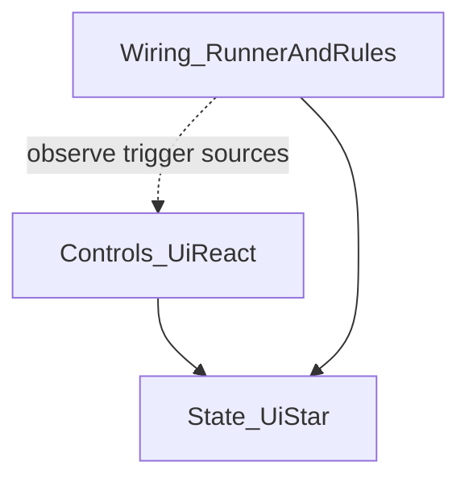

# Ui React — Wiring layer (normative)

**Status:** Normative specification for **Phase P5** (wiring layer). Runtime implementation **must** conform to this document until a superseding revision is recorded in [`CHANGELOG.md`](CHANGELOG.md) and Charter in [`ROADMAP.md`](ROADMAP.md).

**Charter (one line):** Ui React adds a first-class, inspector-authored **wiring layer**—a small **`UiReactWireRunner`** plus a **family of narrow `UiReactWireRule` resources** and **per-control `wire_rules` entry points**—so framework-level orchestration is explicit, serializable, and teachable; an optional **`UiReactWireHub`** centralizes rules for dense screens **after** P5.1 core ships; the **P5.2** dock editor is optional convenience on the **same** resource model.

---

## 1. Problem statement

Root-node **orchestration scripts** (`_ready`, manual `connect`, ad-hoc filtering) are **not** the long-term recommended pattern for **official examples** or for authors who want scenes to read as **nodes + resources**. **Glue** (“tree index → kind string”, “filter + catalog → item rows”, “selection → detail text”) **belongs** in the **wiring layer** as **inspectable rules**, not scattered logic.

---

## 2. Three-layer model

| Layer | Responsibility | What ships |
|-------|----------------|------------|
| **Controls** | Bind UI ↔ `UiState`, emit known signals / lifecycle | `UiReact*` |
| **State** | Hold truth, drafts, commits, computed payloads | `Ui*` states, transactional, computed |
| **Wiring** | When X changes, update Y (paths, small transforms, UI-side reactions) | `UiReactWireRunner` + `UiReactWireRule` (+ optional `UiReactWireHub`) |

Wiring **observes** sources and **writes** target state (or triggers documented side effects). It **does not** replace control bindings or reimplement transactional commit semantics.

**Actions (P6.1):** Inspector **`action_targets`** on the **§5** P5.1 control set drives **non-motion** UI behavior only (focus, visibility, **`Control.mouse_filter`**, narrow UI **`UiBoolState`** flags). Normative contract: [`ACTION_LAYER.md`](ACTION_LAYER.md). **Wiring** still owns **`UiStringState`** catalog/filter/detail data transforms (**§2**); **Actions** must not duplicate those jobs.

---

## 3. `UiReactWireRunner` contract

- **Kind:** Scene-placed `Node` ( **`class_name UiReactWireRunner`** when implemented).
- **Cardinality:** **Exactly one** runner per **scene instance** that uses any wiring (`wire_rules` on any descendant `UiReact*` or rules on an `UiReactWireHub`). **Duplicate runners** in the same scene → **validator error or warning** (**CB-034**).
- **Autoload:** **Forbidden for P5.1** registration of wiring. Diagnostics stay **scene-scoped**; no hidden global registration.
- **Collection:** On `_enter_tree`, the runner **collects** all `UiReactWireRule` instances from:
  1. Every **`wire_rules`** array on descendant **`UiReact*`** nodes in its scene subtree, and
  2. Every **`UiReactWireHub`** node in the same subtree (**P5.1.b**), described in §7.
- **Collection scope (P5.1 implementation):** The runner walks the subtree rooted at **`get_parent()`** when non-null (typical: **screen root** with the runner as its child). Every node carrying **`wire_rules`** must sit under that parent. **P5.1.b** hubs use the same subtree relative to the runner.
- **Ordering:** Rules are applied in **deterministic sort order** by a stable tuple string: `(source_path_string, rule_index_within_array, resource_path_or_uid)`. **P5.1 implementation** uses node path + index within the source array + `rule_id` (or fallback), which satisfies the same **stability** intent.
- **Teardown:** On `_exit_tree`, **disconnect** all signals registered by wiring; **no** leaks.
- **Logging:** On failure: `UiReactWireRunner: rule N failed: <reason> path=<res_path> source=<node> target=<node>` (or equivalent structured message).

---

## 4. `UiReactWireRule` base contract

- **Base type:** `Resource`, abstract **`UiReactWireRule`** (name fixed for public API; **CB-039** SemVer).
- **Serializable:** All fields must round-trip in `.tscn` / `.tres`.
- **Minimum fields (normative intent):** `rule_id: String` (diagnostics), `enabled: bool` default `true`. Concrete sources/targets (node paths, state refs) are defined on **subclasses**.
- **No mega-struct:** **No** single “kitchen sink” reaction type. **Many narrow** subclasses (**CB-033**).

---

## 5. Per-control `wire_rules` export

Each `UiReact*` that can **source** wires exposes **at most one** additional export:

`wire_rules: Array[UiReactWireRule]`  

(Exact typed array when Godot permits; until then: documented as array of `UiReactWireRule`.)

**P5.1 minimum control set** (first implementation wave only; other controls **lack** `wire_rules` until promoted via a new Appendix row):

| Control | Allowed wire triggers (align with `UiAnimTarget.Trigger` where signals match) |
|---------|-------------------------------------------------------------------------------|
| `UiReactItemList` | `SELECTION_CHANGED`, `HOVER_ENTER`, `HOVER_EXIT` |
| `UiReactTree` | `SELECTION_CHANGED`, `HOVER_ENTER`, `HOVER_EXIT` |
| `UiReactLineEdit` | `TEXT_CHANGED`, `TEXT_ENTERED`, `FOCUS_ENTERED`, `FOCUS_EXITED`, `HOVER_ENTER`, `HOVER_EXIT` |
| `UiReactCheckBox` | Match existing checkbox / toggle semantics used for `UiAnimTarget` (`TOGGLED_ON`, `TOGGLED_OFF`, hover, focus as implemented on that control). |
| `UiReactTransactionalActions` | Match button / transactional triggers implemented on that control (`PRESSED`, etc.). |

---

## 6. MVP concrete rule types (P5.1)

Exactly **three** concrete subclasses ship in the first wiring implementation (**capabilities** fixed; field names may vary slightly in code):

1. **`UiReactWireMapIntToString`** — Map an integer source (e.g. tree `selected_state` index) to a **`UiStringState`** via an **editor-authored map** (replaces “tree index → kind” glue).
2. **`UiReactWireRefreshItemsFromCatalog`** — When filter string + optional category string + **catalog reference** change, write **`UiArrayState`** line payloads. **Catalog data lives in the game project** (Resource or documented constant resource); the addon does **not** ship game catalogs (**Non-goals**).
3. **`UiReactWireCopySelectionDetail`** — When list selection index changes, format **`UiStringState`** detail text (format string + paths to row data / catalog indices).

---

## 7. Optional `UiReactWireHub` (P5.1.b)

**Milestone:** **After** P5.1 exit criteria are met (**not** part of P5.1 core).

- **Node type:** **`UiReactWireHub`** (`Node` with **`class_name`**) exposing `rules: Array[UiReactWireRule]`.
- **Purpose:** One **readable** place for power users to hold rules for a whole screen instead of only scattering them on controls.
- **Runner behavior:** `UiReactWireRunner` **merges** rules from all hubs under its subtree with rules from all `wire_rules` exports.
- **Dedup (normative):** The **same** `UiReactWireRule` **resource instance** (same object identity / same subresource reference) must **not** be registered twice. If a rule appears in both a hub and a control array, **implementation** must register **once** and log a **warning** in editor/debug builds—or **validator error** once **CB-041** / **CB-034** are implemented; until then, docs require authors **not** to alias the same subresource in two arrays.
- **Placement:** Must live under the **same scene subtree** as the single **`UiReactWireRunner`**. Validator **CB-041**: flag hub with **no** runner in scene; hub **outside** runner’s scene instance (if detectable).

---

## 8. Interaction with computed and transactional

- Wires **may read** computed or transactional **state** values.
- Wires **must not** replace **`UiReactComputedSync`** or how computed sources are declared.
- Wires **must not** replace **`UiTransactionalGroup`** / **Apply** / **Cancel** semantics.
- Wires **may** listen to `UiBoolState` (e.g. lock toggles) for **UI-only** side effects.

---

## 9. Diagnostics (P5.1)

When **any** descendant `UiReact*` has `wire_rules.size() > 0` **or** an `UiReactWireHub` has `rules.size() > 0`, and **no** `UiReactWireRunner` exists in that edited scene’s wiring scope → **dock warning or error** (**CB-034**).

**CB-034 — shipped in P5.1 (editor dock):**

- Duplicate **`UiReactWireRunner`** nodes in the edited scene → **warning**; **`wire_rules`** present with **no** runner → **warning**.
- **`wire_rules` row validation** (MVP rule types §6): missing / wrong-type **`@export`** state or **`catalog`** refs → **warning** (`UiReactValidatorService`).
- **Unused `UiState` `.tres` diagnostics:** `UiState` resources referenced **only** inside `wire_rules` subresources are counted as used (`UiReactStateReferenceCollector`).
- **`UiReactTransactionalActions`** is registered in `UiReactScannerService` so §5 hosts participate in the same dock passes as other `UiReact*` controls.

**CB-034 extensions** (same backlog IDs `CB-034` / `CB-020`; optional / follow-up): invalid `NodePath` targets when future rules use paths; **P5.1.b** hub without runner / invalid hub placement (**CB-041**). Stock-take: [`P5_CURRENT_STATE_AUDIT.md`](P5_CURRENT_STATE_AUDIT.md).

---

## 10. Phasing

| Milestone | Contents |
|-----------|----------|
| **P5.1** | `UiReactWireRunner`; `UiReactWireRule` + **three** concrete rules (§6); `wire_rules` on §5 control set; dock diagnostics for missing runner; migrate **`inventory_screen_demo`** off orchestration glue (**CB-037**; **CB-036** referred to removed **`inventory_list_demo`**). |
| **P5.1.b** | Optional **`UiReactWireHub`** + runner aggregation + dedup + validator (**CB-041**). |
| **P5.2** | Dock **form or graph** UI that edits **only** existing `UiReactWireRule` subresources—**no second on-disk format** (**CB-035**). |

---

## 11. Explicit non-wiring

The following stay **outside** the wiring core: **pricing**, **loot tables**, **crafting recipes**, **network I/O**, and other **game domain** rules. **Escape hatch:** plain `Control` + manual `UiState` binding per README.

---

## 12. SOLID / DRY / KISS / YAGNI (implementation discipline)

- **SRP:** Runner = lifecycle and ordering; each rule class = one job; controls = bindings.
- **DRY:** One runner pattern, one rule base type; no parallel “wire services.”
- **KISS:** Ship three concrete rule types before adding more.
- **YAGNI:** No autoload for P5.1; no generic graph **solver** language in v1 wiring; no second resource file format.
