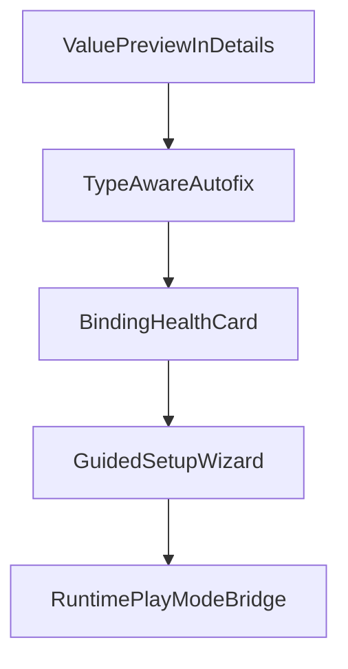

+# UI System Tools — Plugin UX Roadmap

This document is the **canonical index** for planned high-ROI improvements to the **UI System Tools** editor plugin (`addons/ui_system/editor_plugin/`). Implementation proceeds **one feature at a time**; each feature has a dedicated plan under `docs/plugin_ux_plans/`.

## Feature order and dependencies

| Order | Feature | Plan |
|------|---------|------|
| 1 | Preview effective `UiState.value` in issue details | [plugin_ux_plans/feature_value_preview.md](plugin_ux_plans/feature_value_preview.md) |
| 2 | Type-aware autofix (safe conversions) | [plugin_ux_plans/feature_type_autofix.md](plugin_ux_plans/feature_type_autofix.md) |
| 3 | Binding health card (selection-aware summary) | [plugin_ux_plans/feature_binding_health_card.md](plugin_ux_plans/feature_binding_health_card.md) |
| 4 | Guided setup wizard (defaults only, v1) | [plugin_ux_plans/feature_setup_wizard.md](plugin_ux_plans/feature_setup_wizard.md) |
| 5 | Runtime play-mode bridge / live stream (v1) | [plugin_ux_plans/feature_runtime_bridge.md](plugin_ux_plans/feature_runtime_bridge.md) |

### Rationale

1. **Value preview** — Low risk, immediate diagnosis value.
2. **Type-aware autofix** — Builds on visible values; turns warnings into actions.
3. **Health card** — At-a-glance status; reuses scanner binding metadata and validation patterns.
4. **Wizard** — Orchestrates existing create/assign flows after they are stable.
5. **Runtime bridge** — Highest complexity; last to avoid blocking simpler wins.

## Shared constraints (all features)

- **SOLID**: UI orchestration stays in the dock; validation semantics in scanner/validator; resource writes via state factory + action controller.
- **DRY**: Extract shared helpers only after the same logic appears **at least twice** (avoid premature abstraction).
- **KISS**: Ship narrow slices with clear labels and tooltips.
- **YAGNI**: No template/preset marketplace, no persistent runtime export storage, no generic “convert anything” engine until there is concrete demand.

### Scope locks (v1)

- **Runtime bridge v1**: Whole-scene stream with **filtering controls**; defer persistence/export to a later milestone.
- **Setup wizard v1**: **Recommended defaults only** — no template/preset branching.

## Acceptance gates

| Gate | After | Criteria |
|------|--------|----------|
| **A** | Feature 1 | Details show safe value snippet + type with truncation; no noticeable editor slowdown on large scenes. |
| **B** | Feature 2 | At least 2–3 conversion autofix paths work with deterministic migration; failures are non-destructive and reported. |
| **C** | Feature 3 | Health card tracks editor selection and matches diagnostics for bound properties. |
| **D** | Feature 4 | Wizard creates predictable default resources; output path and filename dedupe match existing plugin behavior. |
| **E** | Feature 5 | Whole-scene stream + filters works; stream can be stopped; no runaway updates or editor instability. |

## Rollback strategy

- Each feature lands as a **small, reversible** change set.
- Prefer **feature toggles** (project setting or dock checkbox) only when behavior could surprise users; otherwise ship always-on if low risk.
- If a gate fails, **revert the feature PR** and keep prior plugin behavior; do not stack fixes for unrelated features in the same PR.

## Review cadence

- **After each gate**: Smoke test in editor (Rescan, Selection vs Entire scene, Fix/Fix All, filters).
- **Documentation**: Update user-facing notes in [README.md](README.md) plugin section when a feature ships.
- **Reprioritization**: Re-evaluate order only after a full gate passes; avoid parallel risky work.

## Primary code touchpoints (expected)

| Area | Path |
|------|------|
| Dock UI | `editor_plugin/ui_system_dock.gd` |
| Validation | `editor_plugin/services/ui_system_validator_service.gd` |
| Scan metadata | `editor_plugin/services/ui_system_scanner_service.gd` |
| State files | `editor_plugin/services/ui_system_state_factory_service.gd` |
| Undo/redo assign | `editor_plugin/controllers/ui_system_action_controller.gd` |
