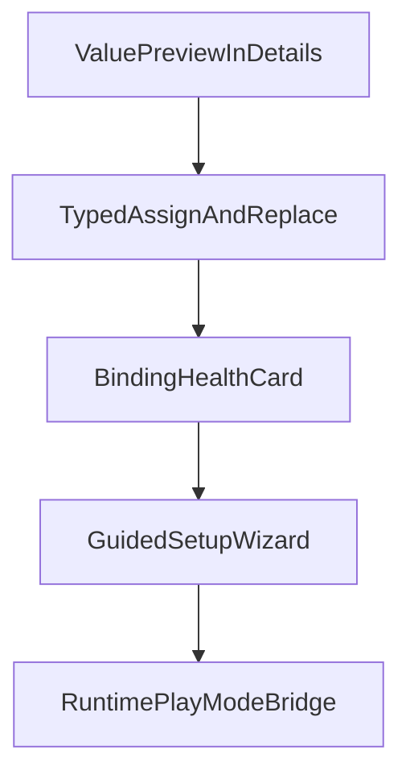

# Ui React — Plugin UX Roadmap

This document is the **canonical index** for planned high-ROI improvements to the **Ui React** editor plugin (`addons/ui_react/editor_plugin/`). Implementation proceeds **one feature at a time**; each feature has a dedicated plan in this folder (see table below).

**Design alignment:** Runtime state uses an **abstract** [`UiState`](../../scripts/api/models/ui_state.gd) base with concrete **`UiBoolState`**, **`UiIntState`**, **`UiFloatState`**, **`UiStringState`**, **`UiArrayState`**. Payloads are read/written via **`get_value()`** / **`set_value()`** on assigned resources; the plugin validates **expected concrete subclasses** per binding (scanner + validator). There is **no** generic `Variant` export on `UiState` and **no** `EditorInspectorPlugin` for assignment interception.

## Feature order and dependencies

| Order | Feature | Plan |
|------|---------|------|
| 1 | Preview effective `get_value()` payload in issue details (scan-time) | [feature_value_preview.md](feature_value_preview.md) |
| 2 | Typed assign / replace autofix (suggested concrete `Ui*State`, undo-safe) | [feature_type_autofix.md](feature_type_autofix.md) |
| 3 | Binding health card (selection-aware summary) | [feature_binding_health_card.md](feature_binding_health_card.md) |
| 4 | Guided setup wizard (typed defaults only, v1) | [feature_setup_wizard.md](feature_setup_wizard.md) |
| 5 | Runtime play-mode bridge / live stream (v1) | [feature_runtime_bridge.md](feature_runtime_bridge.md) |

### Rationale

1. **Value preview** — Low risk, immediate diagnosis; must use **`get_value()`** on concrete resources (not a fictional `UiState.value` field).
2. **Typed assign / replace** — Extends existing **Fix** (create + assign `Ui*State`); **not** a generic “coerce any Variant shape” engine. Avoid in-place float→int for **index** semantics—users create **`UiIntState`** resources instead.
3. **Health card** — At-a-glance status; reuses scanner binding metadata and validator issues (subclass mismatch, empty slots).
4. **Wizard** — Orchestrates **typed** defaults from [`UiReactStateFactoryService`](../../editor_plugin/services/ui_react_state_factory_service.gd) after flows are stable.
5. **Runtime bridge** — Highest complexity; last to avoid blocking simpler wins.

## Shared constraints (all features)

- **SOLID**: UI orchestration stays in the dock; validation semantics in [`UiReactScannerService`](../../editor_plugin/services/ui_react_scanner_service.gd) / [`UiReactValidatorService`](../../editor_plugin/services/ui_react_validator_service.gd); resource writes via [`UiReactStateFactoryService`](../../editor_plugin/services/ui_react_state_factory_service.gd) + [`UiReactActionController`](../../editor_plugin/controllers/ui_react_action_controller.gd).
- **DRY**: Extract shared helpers only after the same logic appears **at least twice** (avoid premature abstraction).
- **KISS**: Ship narrow slices with clear labels and tooltips.
- **YAGNI**: No template/preset marketplace, no persistent runtime export storage, no generic “convert any value shape” engine. **Index-shaped bindings** use **`int`** only (`UiIntState`); do not add silent float→int migration in the plugin.

### Scope locks (v1)

- **Runtime bridge v1**: Whole-scene stream with **filtering controls**; defer persistence/export to a later milestone.
- **Setup wizard v1**: **Recommended typed defaults only** — one concrete `Ui*State` per empty binding per [`BINDINGS_BY_COMPONENT`](../../editor_plugin/services/ui_react_scanner_service.gd); no template/preset branching.

## Acceptance gates

| Gate | After | Criteria |
|------|--------|----------|
| **A** | Feature 1 | Details show safe value snippet + type with truncation (from **`get_value()`**); no noticeable editor slowdown on large scenes. |
| **B** | Feature 2 | At least 2–3 **typed assign** paths (e.g. empty slot → create suggested class; optional **replace** wrong subclass with suggested resource) work with **undo**; failures are non-destructive and reported. **No** mandatory in-place Variant coercion for index fields. |
| **C** | Feature 3 | Health card tracks editor selection and matches diagnostics for bound properties. |
| **D** | Feature 4 | Wizard creates predictable **concrete** `Ui*State` resources; output path and filename dedupe match existing plugin behavior. |
| **E** | Feature 5 | Whole-scene stream + filters works; stream can be stopped; no runaway updates or editor instability. |

## Rollback strategy

- Each feature lands as a **small, reversible** change set.
- Prefer **feature toggles** (project setting or dock checkbox) only when behavior could surprise users; otherwise ship always-on if low risk.
- If a gate fails, **revert the feature PR** and keep prior plugin behavior; do not stack fixes for unrelated features in the same PR.

## Review cadence

- **After each gate**: Smoke test in editor (Rescan, Selection vs Entire scene, Fix/Fix All, filters).
- **Documentation**: Update user-facing notes in [`README.md`](../README.md) plugin section when a feature ships.
- **Reprioritization**: Re-evaluate order only after a full gate passes; avoid parallel risky work.

## Primary code touchpoints (expected)

| Area | Path |
|------|------|
| Dock UI | `addons/ui_react/editor_plugin/ui_react_dock.gd` |
| Validation | `addons/ui_react/editor_plugin/services/ui_react_validator_service.gd` |
| Scan metadata | `addons/ui_react/editor_plugin/services/ui_react_scanner_service.gd` |
| State factory | `addons/ui_react/editor_plugin/services/ui_react_state_factory_service.gd` |
| Undo/redo assign | `addons/ui_react/editor_plugin/controllers/ui_react_action_controller.gd` |
